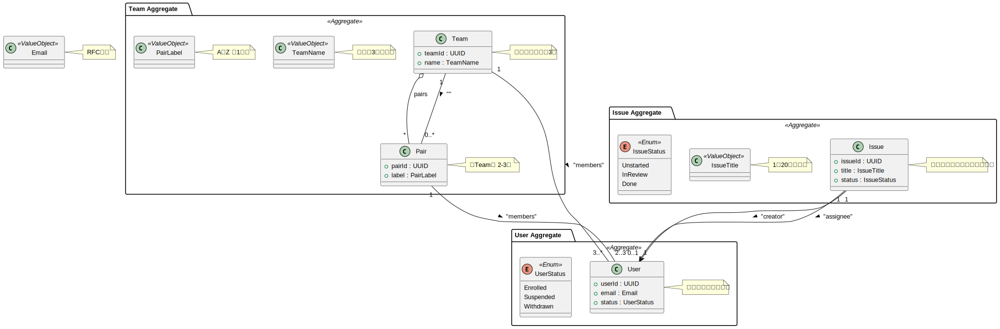
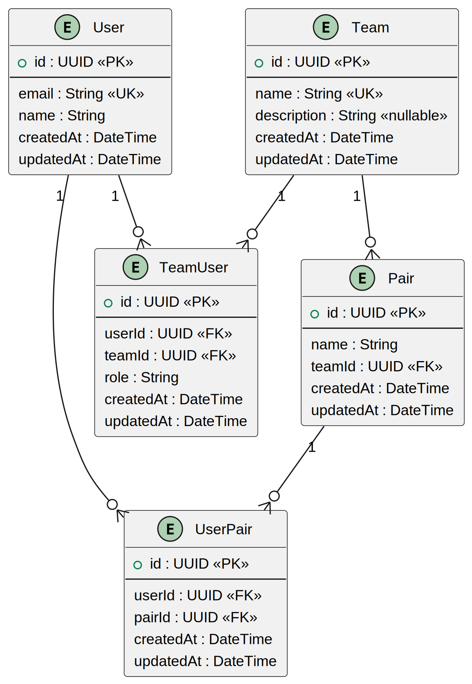

This is a [Next.js](https://nextjs.org) project bootstrapped with [`create-next-app`](https://nextjs.org/docs/app/api-reference/cli/create-next-app).

## Getting Started

First, run the development server:

```bash
npm run dev
# or
yarn dev
# or
pnpm dev
# or
bun dev
```

Open [http://localhost:3000](http://localhost:3000) with your browser to see the result.

You can start editing the page by modifying `app/page.tsx`. The page auto-updates as you edit the file.

This project uses [`next/font`](https://nextjs.org/docs/app/building-your-application/optimizing/fonts) to automatically optimize and load [Geist](https://vercel.com/font), a new font family for Vercel.

## Learn More

To learn more about Next.js, take a look at the following resources:

- [Next.js Documentation](https://nextjs.org/docs) - learn about Next.js features and API.
- [Learn Next.js](https://nextjs.org/learn) - an interactive Next.js tutorial.

You can check out [the Next.js GitHub repository](https://github.com/vercel/next.js) - your feedback and contributions are welcome!

## Deploy on Vercel

The easiest way to deploy your Next.js app is to use the [Vercel Platform](https://vercel.com/new?utm_medium=default-template&filter=next.js&utm_source=create-next-app&utm_campaign=create-next-app-readme) from the creators of Next.js.

Check out our [Next.js deployment documentation](https://nextjs.org/docs/app/building-your-application/deploying) for more details.

## ドメイン概要（集約間の関係）



## エラー設計のルール

このプロジェクトでは、以下のルールに従ってエラーを設計・実装しています：

### 1. エラーの階層構造

```
src/
├── domain/
│   ├── shared/errors/
│   │   └── ValidationError (abstract) - すべてのバリデーションエラーの基底クラス
│   │
│   ├── {domain}/errors/
│   │   ├── {Domain}ValidationError - ドメイン固有のバリデーションエラー
│   │   └── {Domain}DomainError - ドメインのビジネスルール違反エラー
│   │
└── application/
    └── {usecase}/errors/
        └── {UseCase}Error - アプリケーション層固有のエラー
```

### 2. エラーメッセージの形式

- バリデーションエラー: `{プロパティ名}の検証に失敗しました: {具体的な理由}`
  - 例: `メールアドレスの検証に失敗しました: 無効なメールアドレスです: invalid-email`
  - 例: `名前の検証に失敗しました: 名前を入力してください`

- ドメインエラー: `{具体的な理由}`
  - 例: `チームは3名以上のメンバーが必要です（現在: 2名）`
  - 例: `チームメンバーは全員が在籍中である必要があります`

- アプリケーションエラー: `{ユーザーフレンドリーなメッセージ}`
  - 例: `このメールアドレスは既に登録されています`
  - 例: `ユーザーID "1234" が見つかりません`

### 3. エラークラスの命名規則

- バリデーションエラー: `{Target}ValidationError`
  - 例: `EmailValidationError`, `UserNameValidationError`

- ドメインエラー: `{Domain}DomainError`
  - 例: `TeamDomainError`

- アプリケーションエラー: `{UseCase}Error`
  - 例: `DuplicateTeamNameError`, `UserNotFoundError`

### 4. エラー処理の原則

1. **ドメイン層**:
   - 値オブジェクトの不変条件違反 → ValidationError
   - ドメインルールの違反 → DomainError
   - エラーメッセージは技術的な詳細を含む

2. **アプリケーション層**:
   - ユースケース固有の制約違反 → ApplicationError
   - 外部リソースのエラー → 適切なApplicationErrorに変換
   - エラーメッセージはユーザーフレンドリー

3. **プレゼンテーション層**:
   - エラーメッセージの表示のみを担当
   - 必要に応じてエラーメッセージを整形

## データベース構造



主な特徴：
- ユーザー、チーム、ペアの3つの主要エンティティ
- チームとユーザーの多対多関係（TeamUserテーブル）
- ペアとユーザーの多対多関係（UserPairテーブル）
- チーム内でのペア名の一意性保証
- 全エンティティの作成・更新日時の追跡