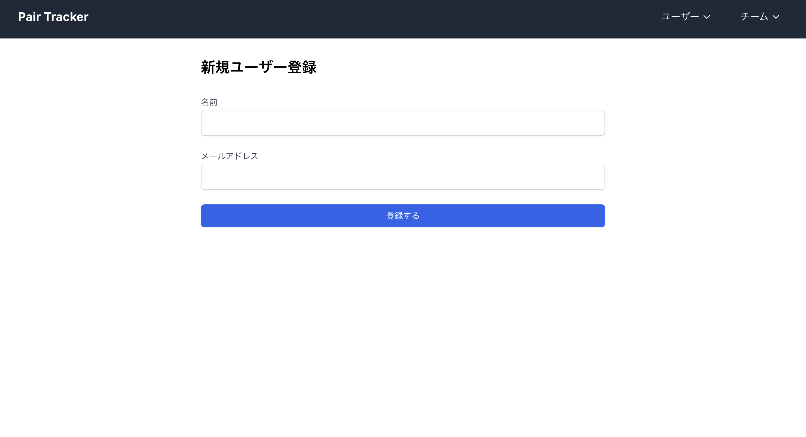
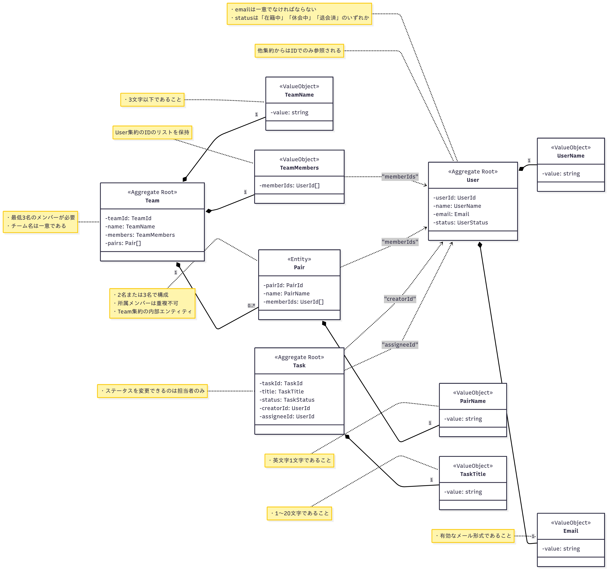
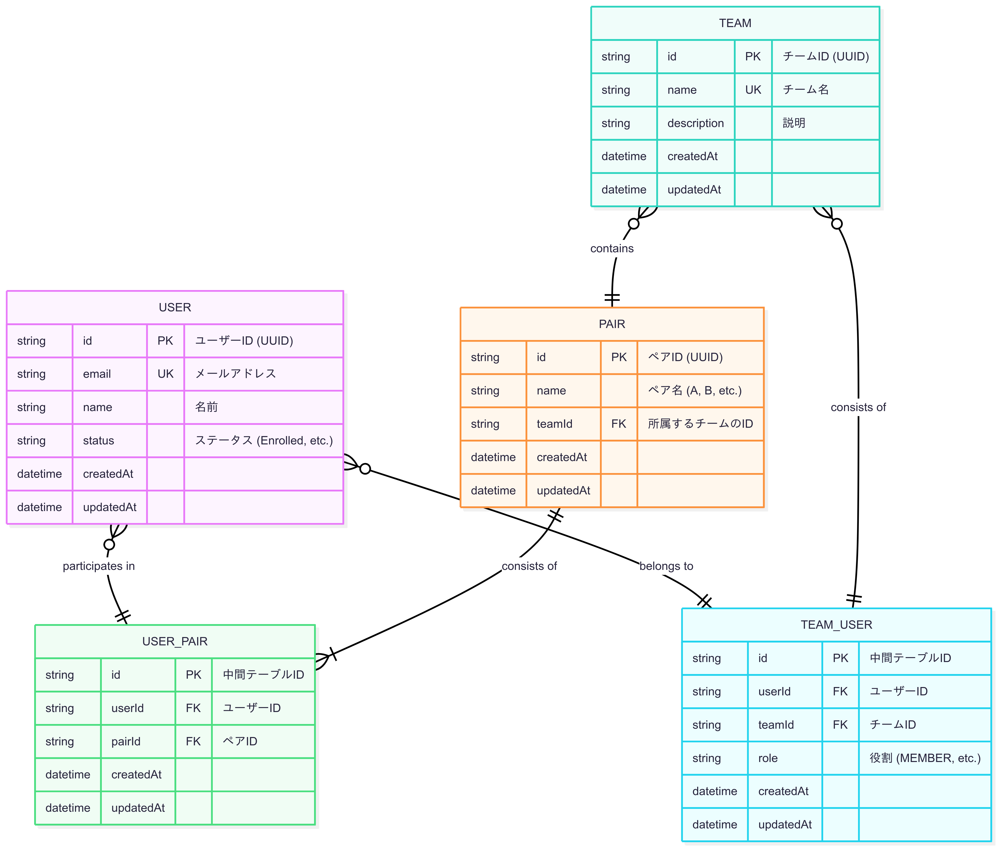

# Pair Tracker

ペアプログラミングのペア編成を管理するためのアプリケーションです。


## セットアップ
必要要件：
- Docker
- Docker Compose


### 初回セットアップ
```bash
# アプリケーションのビルドと起動
docker-compose up -d --build

# データベースのマイグレーション
docker-compose exec app npx prisma migrate dev

```

### 2回目以降の起動
```bash
docker-compose up -d
# ブラウザで http://localhost:3001 にアクセス

# アプリケーションの停止
docker-compose down
```

## wip デプロイ

## ドメインモデル図


## ER図


