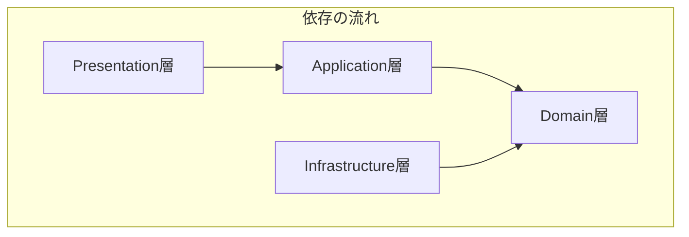
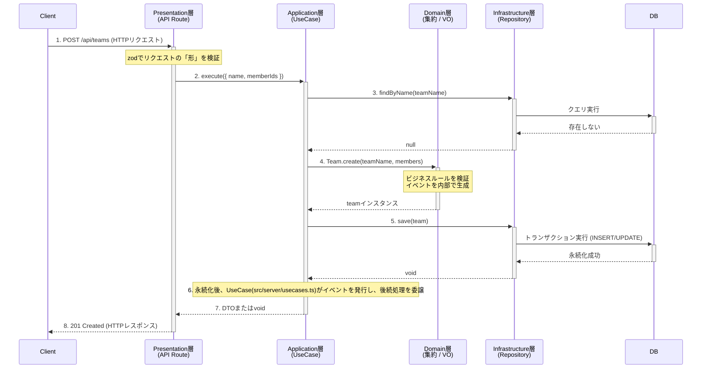

# DDD実装ルールブック

## 1. はじめに
このドキュメントは、本プロジェクトにおけるソフトウェアアーキテクチャの指針を定めるものです。すべてのコードは、ここに記述されたドメイン駆動設計（DDD）およびクリーンアーキテクチャの原則に従って実装される必要があります。
### 2-1. 設計思想：関心の分離と「豊かなドメインモデル」

本プロジェクトのアーキテクチャは、**関心の分離（Separation of Concerns）** を徹底し、**システムの核となるビジネスルール（ドメイン）を、技術的な詳細（UI、データベースなど）から完全に保護する**ことを目的としています。

これにより、以下のメリットを実現します。
* **保守性**: ビジネスルールを変更する際、UIやデータベースの実装を気にする必要がありません。
* **テスト容易性**: ドメインロジックを、UIやデータベースから独立した純粋なユニットテストで検証できます。
* **拡張性**: データベースをPostgreSQLから別のものに切り替えたり、APIをGraphQLに拡張したりする場合でも、ドメイン層への影響を最小限に抑えられます。

この目的を達成するため、本プロジェクトでは**オニオンアーキテクチャ**の考え方を採用し、ビジネスロジックを内包した **「豊かなドメインモデル」** の構築を目指します。

## 2-1. アーキテクチャ概要
本プロジェクトでは、以下の4層からなるレイヤードアーキテクチャを採用します。

### 依存関係の原則
依存関係は、**常に外側のレイヤーから内側のレイヤーに向かいます。** 内側のレイヤーは、外側のレイヤーについて一切知りません。




* **Presentation層**: UIやAPIエンドポイント。`Application`層を利用する。
* **Application層**: ユースケース。`Domain`層を利用する。
* **Infrastructure層**: DBアクセスなど。`Domain`層で定義されたインターフェースを実装する。
* **Domain層**: ビジネスの核。どのレイヤーにも依存しない。

### 例外
例外的に、「データの構造や型定義」に限って、より内側のレイヤーをimportすることを許容する場合もあります。

例えば、カスタムエラーのハンドリングの場合、Presentation層（APIルート）の重要な責務の一つに、「UseCaseからスローされたエラーを解釈し、適切なHTTPステータスコードに変換して返す」というものがあります。
これを実現するためには、catchブロックでエラーの型を具体的に知る必要があります。その場合でも、Domain層のエンティティ（振る舞いを持つクラス）やリポジトリを直接利用することは固く禁止します。

```ts
// app/api/teams/route.ts

// ★ Domain層で定義されたエラー型を直接importしている
import { TeamNameValidationError } from '@/domain/team/errors/TeamNameValidationError';
import { DuplicateTeamNameError } from '@/application/team/errors/TeamErrors';

export async function POST(req: Request) {
  try {
    // ...
    await createTeamUseCase.execute(...);
    // ...
  } catch (error) {
    // ★ Domain層の型を直接知ることで、具体的なエラーハンドリングが可能になる
    if (error instanceof TeamNameValidationError) {
      return NextResponse.json({ ... }, { status: 400 });
    }
    // Application層の型を知ることで、具体的なエラーハンドリングが可能になる
    if (error instanceof DuplicateTeamNameError) {
      return NextResponse.json({ ... }, { status: 409 });
    }
    // ...
  }
}
```


### 2-2. レイヤー構造とデータの流れ

アーキテクチャは以下の4層で構成され、データの流れは常に外側のレイヤーから内側へ向かいます。以下に、典型的なコマンド（例：チーム作成）処理の流れを示します。



## 3. レイヤーごとの実装ルール

### 3-1. Domain層
#### 責務: ビジネスルールの核心。このアプリケーションが「何であるか」を定義する。

#### 配置場所: `src/domain/`

#### 構成要素:
    * **エンティティ**: 一意なIDで識別され、状態と振る舞いを持つオブジェクト (`User`, `Team`など)。
    * **値オブジェクト (VO)**: 値そのものが意味を持つ不変のオブジェクト (`Email`, `TeamName`など)。
    * **リポジトリのインターフェース**: データの永続化に関する「契約書」 (`IUserRepository`など)。


#### 実装ルール:
**1. フレームワーク・ライブラリからの完全な独立**<br>
- ルール: Prisma, zod, Next.jsのAPIなど、外部の技術やライブラリを一切importしてはなりません。この層は、純粋なTypeScriptのみで記述されるべきです。
- 理由: ビジネスの核であるドメイン層を、UIやデータベースといった技術的な決定から完全に隔離するためです。これにより、将来データベースを別のものに交換しても、ドメイン層のコードは一切変更する必要がありません。

**2. 値オブジェクトによる「型」と「制約」の表現**<br>
- ルール: stringやnumberといったプリミティブ型を直接使うのではなく、ビジネス上の意味と制約を持つ値オブジェクト（VO）として定義します。VOの生成は、検証ロジックを内包したpublic static createファクトリメソッドに限定し、コンストラクタはprivateにします。
- 理由: 不正な値を持つドメインオブジェクトの存在をコンパイルレベルで防ぎ、システムの堅牢性を高めます。

**3. 集約ルートによる整合性の保護**
- ルール: 集約ルート（TeamやUserエンティティ）は、自身の状態を変更するメソッド内で、ビジネスルール（不変条件）を必ず検証します。これにより、集約は常に正しい状態が保たれます。
- 理由: ドメインの整合性を保証する責任を集約ルートに集中させることで、ロジックが分散せず、見通しの良い設計になります。
```ts
// src/domain/team/Team.ts
export class Team extends AggregateRoot {
  // ...
  public removeMember(memberIdToRemove: string): void {
    // ... メンバー存在チェック ...

    const updatedMemberCount = this.members.count() - 1;
    if (updatedMemberCount < 3) {
      // 自身の不変条件（最低3名）を検証し、違反すればエラーを投げる
      throw TeamBusinessRuleError.memberCountNotMet(updatedMemberCount);
    }

    this.members = this.members.remove(memberIdToRemove);
    this.addDomainEvent(new TeamMemberRemoved(this.teamId, memberIdToRemove));
  }
}
```
**4. イベントは不変の「事実」として設計する**
- ルール: イベントは過去に起きた出来事を表すため、一度生成されたら状態が変わらないようにreadonlyプロパティで設計し、TeamCreatedのように過去形の名前を付けます。
- 理由: イベントは「起きてしまったこと」の記録であり、後から内容が変更されてはならないためです。
```ts
// src/domain/team/events/TeamCreated.ts
import { DomainEvent } from '../../shared/DomainEvent';

export class TeamCreated implements DomainEvent {
  public readonly occurredAt: Date;

  constructor(
    public readonly teamId: string,
    public readonly teamName: string,
    public readonly memberIds: string[]
  ) {
    this.occurredAt = new Date();
  }
}
```

**5. ドメインイベントの生成は集約ルートの責務とする**
- ルール: エンティティの状態が変化するメソッド（例: team.removeMember()）の内部で、対応するイベントを生成し、集約ルートが持つイベントリストに追加します。
- 理由: ビジネスロジックの実行と、それが引き起こした「事実（イベント）」の発生を常に一対に保ち、整合性を保証するためです。
- 補足: イベントを実際に発行（ディスパッチ）するのはApplication層の責務です。Domain層はイベントを生成するだけで、それがどのように使われるかを知りません。
```ts
// src/domain/team/Team.ts
import { AggregateRoot } from '../shared/AggregateRoot';

export class Team extends AggregateRoot {
  // ...
  public removeMember(memberIdToRemove: string): void {
    // ... メンバー削除のビジネスロジック ...

    this.members = this.members.remove(memberIdToRemove);

    // 自身の状態変更に伴い、イベントを生成して追加する
    this.addDomainEvent(new TeamMemberRemoved(this.teamId, memberIdToRemove));
  }
}
```

---

### 3-2. Application層 (Use Case層)
#### 責務: ユースケース（ユーザーがシステムで何を行いたいか）の実現。ドメイン層とインフラ層の協調。

#### **配置場所**: `src/application/`

#### **構成要素**:
    * **ユースケースクラス**: １つのパブリックメソッド（`execute`）を持つクラス (`RegisterUserUseCase`など)。
    * **DTO (Data Transfer Object)**: Presentation層にデータを渡すための、メソッドを持たない純粋なデータの入れ物 (`UserDTO`など)。

#### **実装ルール**:
**1.ビジネスロジックはDomain層に委譲する**<br>
- ルール: UseCaseは、ビジネスルールの詳細を自身で実装してはなりません。ドメインオブジェクトを取得し、そのメソッドを呼び出すことに徹します。
- 理由: ドメインの知識をドメイン層に集約し、「豊かなドメインモデル」を維持するためです。
- 悪い例：
```ts
// src/application/team/usecases/RemoveMemberFromTeamUseCase.ts
export class RemoveMemberFromTeamUseCase {
  async execute(teamId: string, memberId: string): Promise<void> {
    const team = await this.teamRepository.findById(teamId);
    // ...
    // NG! 本来はTeamエンティティが持つべきビジネスルール
    if (team.getMemberIds().length - 1 < 3) {
      throw new Error('メンバーは3人未満にできません');
    }
    // ...
  }
}

```

**2. 集約をまたぐルールはUseCaseが調整する**
- ルール: ある操作の前提条件として、複数の集約の状態を確認する必要がある場合、その調整はUseCaseが担当します。
- 理由: 各集約は他の集約の内部状態を知るべきではないため、両方の集約を利用できるUseCaseが調整役を担うのが最適です。
```ts
// src/application/team/usecases/CreateTeamUseCase.ts
export class CreateTeamUseCase {
  async execute(name: string, memberIds: string[]): Promise<void> {
    // ... チーム名重複チェック ...

    // User集約とTeam集約をまたぐルールを調整
    const users = await this.userRepository.findByIds(memberIds);
    const nonEnrolledUser = users.find(user => !user.isEnrolled());
    if (nonEnrolledUser) {
      throw new InvalidUserStatusError(...); // 前提条件エラー
    }

    const team = Team.create(TeamName.create(name), ...);
    await this.teamRepository.save(team);
  }
}
```

**3. 依存関係はインターフェースにのみ依存する**
- ルール: UseCaseは、Infrastructure層の具象クラス（UserRepositoryPrismaなど）に依存してはなりません。必ずDomain層で定義されたインターフェース（IUserRepositoryなど）にのみ依存します。
- 理由: Application層を、データベースなどの具体的な技術から完全に独立させるためです（依存性逆転の原則）。
- 悪い例:
```ts
// NG! 具象クラスに依存している
import { TeamRepositoryPrisma } from '@/infrastructure/repositories/TeamRepositoryPrisma';

export class CreateTeamUseCase {
  constructor(private readonly teamRepository: TeamRepositoryPrisma) {}
}
```
- 良い例
```ts
// OK! インターフェースに依存している
import { ITeamRepository } from '@/domain/team/ITeamRepository';

export class CreateTeamUseCase {
  constructor(private readonly teamRepository: ITeamRepository) {}
}
```

---

### 3-3. Presentation層
#### **責務**:
システムの唯一の「入口」として、ユーザーや外部クライアントとのインタラクションに責任を持つ。
主な仕事は、HTTPリクエストを解釈してApplication層に渡し、その結果を解釈してHTTPレスポンスとして返すことで。

#### **配置場所**: `src/app/`, `src/components/`

#### * **構成要素**:
    * Next.jsのAPI Routes (`/app/api/...`)
    * Reactコンポーネント
    * zodスキーマ（リクエスト検証用）

#### **実装ルール**:
**1. ビジネスロジックは全てUseCaseに委譲する**
- ルール: APIルートは、リクエストの形式をzodで検証した後、即座にApplication層のUseCaseに処理を委譲します。DBへの直接アクセスや、ビジネスルールの実装を決して行ってはなりません。
- 理由: Presentation層を、ビジネスロジックから切り離された薄い層に保つためです。
- 悪い例:
```ts
// app/api/teams/route.ts
import { prisma } from '@/lib/prisma'; // NG! prismaに直接依存

export async function POST(req: Request) {
  const { name } = await req.json();
  // NG! ビジネスロジックを直接実装
  const existing = await prisma.team.findUnique({ where: { name } });
  if (existing) { /* ... */ }
}
```

**2. zodによる厳格な入力検証**
- ルール: 全てのAPIルートは、処理を開始する前に、必ずzodスキーマを使ってリクエストのボディ、パラメータ、クエリ文字列の形式と型を検証しなければならない。
- 理由: 信頼できない外部からの入力をシステムの入り口で完全に無害化するため。これにより、後続のApplication層やDomain層は、データの「形」が正しいことを信頼して、ビジネスロジックの検証に集中できる。
- 補足: zodでの検証（例：文字数制限）とDomain層のValueObjectでの検証が重複する場合があるが、これは意図的な設計である。zodは不正なリクエストを早期に弾くための「第一の防御壁」、ValueObjectはドメインの整合性を保証する「最後の砦」として、それぞれが責務を果たす。


**3. 結果とエラーをHTTPレスポンスへ責任を持って変換する**
- ルール: UseCaseから返された結果（成功時のDTOや、失敗時のカスタムエラー）を解釈し、適切なHTTPステータスコードとJSONボディを持つNextResponseオブジェクトを生成して返す。これがPresentation層の最終的な仕事である。
- 理由: HTTPプロトコルに関する知識と責任を、Presentation層に完全に閉じ込めるため。Application層やDomain層は、HTTPのことを一切意識する必要がない。

**4. 依存関係の厳守**
- ルール: Presentation層は、原則としてApplication層（のUseCase）にのみ依存する。ただし、以下の例外を許容する。
  - importして良いもの:
    - Application層 / Domain層で定義されたカスタムエラーの型（instanceofでの判定のため）
    - Application層で定義されたDTOの型（レスポンスの型付けのため）
    - libなどで共有されるzodスキーマ
  - importしてはならないもの:
    - Infrastructure層の具象クラス（UserRepositoryPrismaなど）
    - Domain層の振る舞いを持つクラス（Teamエンティティなど）やリポジトリインターフェース（ITeamRepository）
- 理由: アーキテクチャのレイヤー間の依存関係を厳格に保ち、システムの疎結合性を維持するため。


---

### 3-4. Infrastructure層
#### **責務**: データベースアクセスや外部API連携など、技術的な詳細の実装。

#### **配置場所**: `src/infrastructure/`

#### **構成要素**:
    * リポジトリの実装クラス (`UserRepositoryPrisma`)
    * PrismaClientのインスタンス

#### **実装ルール**:
**1: Domain層のインターフェースを忠実に実装する**
- ルール: class TeamRepositoryPrisma implements ITeamRepository のように、必ずDomain層で定義されたインターフェースをimplementsし、その契約（メソッド名、引数、戻り値の型）を厳密に守ります。
- 理由: Application層が具象クラスではなくインターフェースに依存することで、将来DB実装を入れ替えることが可能になります（依存性逆転の原則）。
- 悪い例:
```ts
// IUserRepository.ts
// findByIdはUser | nullを返すと契約している
interface IUserRepository {
  findById(id: string): Promise<User | null>;
}

// UserRepositoryPrisma.ts
// NG! 契約違反。Prismaが返す生のオブジェクトをそのまま返してしまっている
class UserRepositoryPrisma implements IUserRepository {
  async findById(id: string): Promise</* User | null */ any> {
    return this.prisma.user.findUnique({ where: { id } });
  }
}
```

**2: ドメインオブジェクトと永続化モデルの変換に責任を持つ**
- ルール: リポジトリは「翻訳者」です。DBから取得したデータ（Prismaのモデルなど）を、ドメインオブジェクトのrebuildファクトリメソッドを使って再構築します。逆に、saveする際はドメインオブジェクトを分解し、Prismaが理解できる形式に変換します。
- 理由: この「翻訳」のロジックをリポジトリに集約することで、Domain層は永続化の形式を一切意識する必要がなくなり、純粋性を保てます。
```ts
// UserRepositoryPrisma.ts
class UserRepositoryPrisma implements IUserRepository {
  async findById(id: string): Promise<User | null> {
    // 1. DBから永続化モデルを取得
    const dbUser = await this.prisma.user.findUnique({ where: { id } });
    if (!dbUser) return null;

    // 2. 「翻訳」処理：永続化モデルを引数に、ドメインオブジェクトを再構築
    return User.rebuild(
      dbUser.id,
      dbUser.name,
      dbUser.email,
      dbUser.status as UserStatus
    );
  }
}
```

**3. ドメインの知識を推測・ハードコーディングしない**
- ルール: リポジトリは、あくまでDBのデータを忠実にドメインオブジェクトにマッピングするだけであり、「この値はこうあるべきだ」といったビジネスルールを推測して値をハードコーディングしてはなりません。
- 理由: データの「真実（Single Source of Truth）」は常にデータベースにあります。リポジトリが勝手な解釈でデータを作ると、アプリケーション内でデータ不整合が起き、深刻なバグの原因となります。
- 悪い例
```ts
// UserRepositoryPrisma.ts
async findById(id: string): Promise<User | null> {
  const user = await this.prisma.user.findUnique({ where: { id } });
  if (!user) return null;

  // NG! DBの`user.status`を無視し、「在籍中」というドメインの知識を
  // リポジトリが推測・ハードコーディングしてしまっている
  return User.rebuild(user.id, user.name, user.email, UserStatus.Enrolled);
}
```

- 良い例
```ts
// UserRepositoryPrisma.ts
async findById(id: string): Promise<User | null> {
  const user = await this.prisma.user.findUnique({ where: { id } });
  if (!user) return null;
  // OK! DBから取得した`user.status`をそのまま使って再構築する
  return User.rebuild(user.id, user.name, user.email, user.status as UserStatus);
}
```

**4. 効率的で安全なデータ更新戦略を採用する**
- ルール: 関連を持つデータの更新時、特にコレクション（例：チームメンバー）の更新では、安易な「全削除・全再作成」方式を避け、差分更新やORMの機能を活用した安全な方法を採用します。
- 理由: 「全削除・全再作成」は、パフォーマンスの悪化や、中間テーブルが持つ情報（参加日時など）のデータ損失に繋がるためです。
- 悪い例:
```ts
// TeamRepositoryPrisma.ts saveメソッド内
// NG! 既存メンバーを全員削除し、新しいリストで再作成している
await tx.teamUser.deleteMany({ where: { teamId } });
await tx.teamUser.createMany({ data: newMembers.map(...) });
```
- 良い例
```ts
// TeamRepositoryPrisma.ts saveメソッド内
// OK! 現在の状態と比較し、追加・削除するメンバーの差分のみを更新している
const currentMemberIds = ...;
const newMemberIds = ...;

const membersToAdd = newMemberIds.filter(id => !currentMemberIds.has(id));
const membersToRemove = Array.from(currentMemberIds).filter(id => !newMemberIds.includes(id));

await tx.teamUser.deleteMany({ where: { teamId, userId: { in: membersToRemove } } });
await tx.teamUser.createMany({ data: membersToAdd.map(...) });
```


## 4. 依存関係の解決
オブジェクトの生成と依存関係の注入（DI）は、アプリケーション全体で一箇所に集約する。

* **場所**: `src/server/usecases.ts`
* **役割**: アプリケーション起動時に、`PrismaClient`、全てのリポジトリ、全てのUseCaseのインスタンスを生成する。
* **ルール**: `PrismaClient`はシングルトンとして扱う。各UseCaseのインスタンスは、このファイルから`export`され、`Presentation`層で`import`して利用する。

※ `src/server/usecases.ts`のような一元管理の場所がないと、Presentation層のAPI中で直接UseCaseやRepositoryを生成することになる（密結合）。
```ts
// Presentation層 (もしルールがなかった場合の悪い例)
// /src/app/api/users/route.ts

import { UserRepositoryPrisma } from "../../../infrastructure/repositories/UserRepositoryPrisma";
import { RegisterUserUseCase } from "../../../application/user/usecases/RegisterUserUseCase";
import { PrismaClient } from "@prisma/client";

export async function POST(req: Request) {
  // 1. 使う場所で、依存オブジェクトを自分で組み立てる
  const prisma = new PrismaClient(); // 非効率！
  const userRepository = new UserRepositoryPrisma(prisma);
  const registerUserUseCase = new RegisterUserUseCase(userRepository, /* eventBusは？ */);

  // 2. ユースケースを実行
  const user = await registerUserUseCase.execute(...);
  // ...
}
```

## 4. 依存関係の解決 (Dependency Injection)

### 4-1. 原則: Composition Rootによる一元管理

本プロジェクトでは、オブジェクトの生成と、それらの間の依存関係の注入（Dependency Injection, DI）は、アプリケーション内のただ一つの場所（**Composition Root**）に集約します。

* **場所**: `src/server/usecases.ts`
* **役割**: アプリケーション起動時に、`PrismaClient`、全てのリポジトリ、全てのUseCaseのインスタンスを生成し、必要な依存関係を解決（「配線」）します。
* **ルール**: `Presentation`層などの利用側は、ここで組み立てられた完成品の`UseCase`インスタンスを`import`して利用するだけにします。

### 4-2. 課題: なぜこのルールが必要か？

もしこのルールがない場合、`Presentation`層など、オブジェクトを**利用する側**が、そのオブジェクトの**生成方法**まで知る必要が生まれます。

```typescript
// ルールがない場合の悪い例: Presentation層での直接生成
// /src/app/api/users/route.ts

import { UserRepositoryPrisma } from "../../../infrastructure/repositories/UserRepositoryPrisma";
import { RegisterUserUseCase } from "../../../application/user/usecases/RegisterUserUseCase";
import { PrismaClient } from "@prisma/client";

export async function POST(req: Request) {
  // 使う場所で、依存オブジェクトを自分で組み立てている
  const prisma = new PrismaClient(); // 非効率！
  const userRepository = new UserRepositoryPrisma(prisma);
  const registerUserUseCase = new RegisterUserUseCase(userRepository, /* eventBusは？ */);

  const user = await registerUserUseCase.execute(...);
  // ...
}
```
この「利用側での直接生成」には、以下のような深刻な問題があります。

- 密結合: Presentation層がApplication層とInfrastructure層の具体的な実装（UserRepositoryPrismaなど）に強く依存してしまいます。これでは、リポジトリの実装を変更しただけで、それを呼び出している全てのAPIルートを修正する必要が生まれます。
- 責務の混在: Presentation層は本来HTTPの処理に集中すべきなのに、「オブジェクトを組み立てる」という、アプリケーション全体の構成に関する知識まで持つことになり、責務が肥大化します。
- インスタンス管理の破綻: PrismaClientのように、アプリケーション全体で一つであるべきインスタンス（シングルトン）を、リクエストのたびにnewしてしまい、パフォーマンスの悪化やリソースの枯渇を招きます。
- テストの困難さ: UseCaseとリポジトリが固く結びついているため、テスト時にリポジトリだけをモックに差し替える、といったことが非常に困難になります。

### 4-3. 解決策: 本プロジェクトにおける実装
上記の課題を解決するため、src/server/usecases.tsが「オブジェクトの組み立て工場」としての全責任を負います。

```ts
// 良い例: src/server/usecases.ts

import { PrismaClient } from '@prisma/client';
import { TeamRepositoryPrisma } from '@/infrastructure/repositories/TeamRepositoryPrisma';
import { UserRepositoryPrisma } from '@/infrastructure/repositories/UserRepositoryPrisma';
import { CreateTeamUseCase } from '@/application/team/usecases/CreateTeamUseCase';
import { IEventBus } from '@/domain/shared/IEventBus';
// ... 他のUseCaseやハンドラーのimport

// 1. アプリケーション全体で共有するインスタンスを生成
const prisma = new PrismaClient();
// アプリケーション終了時に接続を閉じる
process.on('beforeExit', async () => {
  await prisma.$disconnect();
});

// 2. イベントバスのシンプルな実装を作成
const eventBus: IEventBus = { /* ... dispatchロジック ... */ };

// 3. リポジトリの具象クラスをインスタンス化
const teamRepository = new TeamRepositoryPrisma(prisma);
const userRepository = new UserRepositoryPrisma(prisma);

// 4. UseCaseに必要な依存（リポジトリ、イベントバス等）を注入してインスタンス化
const createTeamUseCaseInstance = new CreateTeamUseCase(
  teamRepository,
  userRepository,
  eventBus
);


// 5. 完成品のUseCaseインスタンスをexportする
export const createTeamUseCase = createTeamUseCaseInstance;
// ... 他のUseCaseも同様にexport
```
この方法により、Presentation層はオブジェクトの複雑な生成過程を一切知ることなく、import { createTeamUseCase }とするだけで、即座に利用可能な完成品を手に入れることができます。

### 4-4. 代替案（参考）
依存関係を解決するアプローチは他にも存在します。ただ、いずれも管理コストが高くなる理由から見送っています。

- DIライブラリの利用:
  - tsyringeやInversifyJS、NestJSのDI機能のような、依存性の注入を専門に行うライブラリを利用する方法。大規模で依存関係が非常に複雑な場合に強力ですが、ライブラリへの学習コストと依存が発生します。
- 手動DIコンテナクラスの作成:
  - registerやresolveといったメソッドを持つDiContainerクラスを自前で作成する方法。ライブラリに近い機能を持ちつつ、外部依存をなくせますが、自前で管理するコードが増えます。


## 5. `zod`の利用ルール
`zod`は、信頼できない外部からのデータを検証する「門番」として利用する。

* **利用場所**:
    1.  **Presentation層 (API Route)**: **必須**。全てのAPIリクエストを検証する。
    2.  **フロントエンド (Reactコンポーネント)**: **推奨**。UX向上や意図しない値を画面に表示しないため、クライアントサイドでもバリデーションを行う。
* **スキーマの置き場所**: `src/lib/schemas/`に配置し、フロントエンドとバックエンドで共有する。
* **利用しない場所**: `Domain`層/`Infrastructure`層/`Application`層は、`zod`の存在を知ってはならない（ただし、`Infrastructure`層がサードパーティの外部APIと通信する場合は例外とする）。

## 6. ドメインイベント

### 6-1. 原則: 集約間の疎結合を実現する

ドメインイベントの主な目的は、**ある集約で発生した出来事が、別の集約に影響を与える際の直接的な依存関係をなくし、関心を分離すること**です。

これにより、各ドメインは適切に責務を分離でき、拡張性の高い設計になることが期待できます。

### 6-2. 導入の判断基準

#### ルール6-2-1: 集約の境界を越える副作用のために利用する

ドメインイベントは、**ある集約（例: `User`）の状態変更が、別の集約（例: `Team`, `Pair`）への後続処理（副作用）を必要とする場合**に導入します。

* **適切な例**: ユーザーが「退会」した時（`User`集約の変更）、そのユーザーを所属する全ての`Team`集約から脱退させる。この場合、`UserWithdrew`（ユーザーが退会した）イベントを発行します。

* **不適切な例**: チーム作成時に、名前が3文字以下であるか検証する。これは`Team`集約内で完結する単純な検証であり、イベントは不要です。

### 6-3. 実装ルール

#### ルール6-3-1: イベントは不変の「事実」として過去形で命名する

イベントは、過去に発生した変更不可能な「出来事」を表します。そのため、必ず**不変（Immutable）なオブジェクト**として設計し、**過去形の動詞**で命名します。

* 良い例: `UserRegistered`, `TeamCreated`, `TaskCompleted`
* 悪い例: `CreateUser`, `CompleteTask`

#### ルール6-3-2: イベントの発生は集約ルートの責務とする

ビジネス上、イベントを発生させるべき重要な出来事かどうかを判断するのは、**集約ルート（エンティティ）自身**の責務です。集約は、自身の状態が変更されるメソッド内でイベントを生成します。

```typescript
// src/domain/user/User.ts
import { AggregateRoot } from '../shared/AggregateRoot'; // ドメインイベントを管理する基底クラス
import { DomainError } from '../shared/DomainError';
import { UserStatus } from './UserStatus';
import { UserWithdrew } from '../events/UserWithdrew';

class User extends AggregateRoot {
  // ... constructor etc.

  public withdraw(): void {
    if (this.status === UserStatus.Withdrawn) {
      throw new DomainError('既に退会済みのユーザーです。');
    }
    this.status = UserStatus.Withdrawn;

    // 自身の状態変更に伴い、イベントを生成する
    this.addDomainEvent(new UserWithdrew(this.id));
  }
}
```

#### ルール6-3-3: イベントの発行はApplication層（UseCase）の責務とする
生成されたイベントを実際にイベントバスへ通知（発行・ディスパッチ）するのは、**Application層（UseCase）**の責務です。これにより、ドメイン層はイベントバスというインフラ層の仕組みに依存せずに済みます。

発行は、必ず集約の状態が正常に永続化された後に行います。

```ts
// src/application/user/usecases/WithdrawUserUseCase.ts
import { IUserRepository } from '../../../domain/user/IUserRepository';
import { IEventBus } from '../../../domain/shared/IEventBus';

export class WithdrawUserUseCase {
  constructor(
    private readonly userRepository: IUserRepository,
    private readonly eventBus: IEventBus
  ) {}

  async execute(userId: string): Promise<void> {
    // 1. 集約を取得
    const user = await this.userRepository.findById(userId);
    if (!user) {
      throw new Error('User not found');
    }

    // 2. ドメインロジックを実行（この中でイベントが生成される）
    user.withdraw();

    // 3. まず状態を永続化する
    await this.userRepository.save(user);

    // 4. 永続化が成功した後、イベントを発行する
    await this.eventBus.dispatch(user.getDomainEvents());
  }
}
```
#### ルール6-3-4: イベントハンドラーは独立したUseCaseとしてApplication層に配置する
イベントを購読して具体的な処理を行うイベントハンドラーは、特定のイベントに反応する小さなUseCaseと見なせます。そのため、Application層に配置し、必要に応じてリポジトリなどのインフラ層のインターフェースに依存します。

- `src/application/team/event-handlers/RemoveUserFromTeamsOnUserWithdrewHandler.ts`
- `src/application/pair/event-handlers/InvalidatePairsOnUserWithdrewHandler.ts`


## 7. ドメインサービスの利用方針

### 7-1. 原則: 現時点では導入しない

本プロジェクトでは、ドメイン層のロジックを極力エンティティおよび値オブジェクトに集約させる「豊かなドメインモデル」を目指します。

そのため、原則として**ドメインサービスは導入せず**、よりシンプルな責務分担による設計を維持します。

### 7-2. 理由: 関心の分離と責務の明確化

安易なドメインサービスの利用は、エンティティからロジックが失われ、単なるデータ置き場になってしまう「貧血なドメインモデル」を招くリスクがあります。

本プロジェクトのアーキテクチャでは、以下の責務分担を基本とします。

* **ドメイン層 (エンティティ / 値オブジェクト)**:
    * 自己完結したビジネスルールを担当する**「専門家」**。
    * 自身の状態と振る舞いに責任を持つ。

* **アプリケーション層 (UseCase)**:
    * 複数のドメインオブジェクトやリポジトリを調整し、業務フローを実現する**「指揮者（オーケストレーター）」**。
    * ドメイン知識そのものではなく、その「使い方」に責任を持つ。

### 7-3. 代替アプローチ: UseCaseによるオーケストレーション

複数の集約が関わるロジックは、ドメインサービスを新たに設けず、**Application層のUseCaseがその調整役を担います。**

```typescript
// 例: ユーザーをチームに追加するUseCase

export class AddUserToTeamUseCase {
  constructor(
    private readonly userRepository: IUserRepository,
    private readonly teamRepository: ITeamRepository
  ) {}

  async execute(userId: string, teamId: string): Promise<void> {
    // 1. 必要なエンティティを取得
    const user = await this.userRepository.findById(userId);
    const team = await this.teamRepository.findById(teamId);

    // 2. エンティティ自身のメソッドを呼び出し、ルールを検証
    //    (この調整がUseCaseの役割)
    if (!user.canJoinTeam()) {
      throw new UserCannotJoinTeamError(user.getName());
    }

    // 3. ドメインの振る舞いを実行
    team.addMember(user);

    // 4. 結果を永続化
    await this.teamRepository.save(team);
  }
}
```


### 7-4. 再検討のタイミング
以下のケースに該当し、UseCaseの責務がビジネスロジックで肥大化し始めた場合に、ドメインサービスの導入を例外的に検討します。

1. 複数のUseCaseで、ドメインに関する複雑なロジックが重複する場合。
2. それ自体が状態を持たない、重要なビジネス上の「プロセス」や「ポリシー」を表現する必要がある場合。（例: ユーザーのスコアリング計算、タスクの自動割り当てポリシーなど）

## 8. トランザクション管理
**責務**: データの整合性を保証する。

* **ルール**:
    1. トランザクションの境界は **集約単位** とする
    2. 1つのトランザクションで複数の集約を更新してはならない
    3. PrismaClientの提供する単一操作トランザクションを基本とする
    4. 複数の操作を1つのトランザクションで扱う必要がある場合のみ、明示的なトランザクション制御を行う

```typescript
// Infrastructure層での例（単一操作）
class UserRepositoryPrisma implements IUserRepository {
  async save(user: User): Promise<void> {
    // PrismaClientが自動的にトランザクションを管理
    await this.prisma.user.upsert({
      where: { id: user.getUserId() },
      create: { /* ... */ },
      update: { /* ... */ }
    });
  }
}

// 複数操作が必要な場合の例
class TeamRepositoryPrisma implements ITeamRepository {
  async saveTeamWithPairs(team: Team): Promise<void> {
    // 明示的なトランザクション制御
    await this.prisma.$transaction(async (tx) => {
      await tx.team.upsert({ /* ... */ });
      await tx.pair.createMany({ /* ... */ });
    });
  }
}
```

## 9. エラーハンドリング

### 9-1. 原則: エラーを「表現力のあるオブジェクト」として扱う

エラーは、単なる処理の失敗を示すものではなく、**「何が、なぜ、どのように失敗したのか」という具体的な情報を持つ、表現力のあるオブジェクト**として扱います。

これにより、呼び出し側のコードはエラーの型を元に具体的な分岐処理を行うことができ、堅牢でデバッグしやすいシステムを実現します。`new Error("some message")` のような汎用エラーの利用は、予期せぬ例外を除き、極力避けてください。

### 9-2. カスタムエラーを作成する判断基準

#### ルール9-2-1: 呼び出し側がエラーに応じた分岐処理を必要とする場合に作成する

カスタムエラーは、**そのエラーを受け取った呼び出し側のコード（例: Presentation層）が、エラーの種類に応じて具体的な処理（例: 特定のHTTPステータスコードの返却）を決定する必要がある場合**に作成します。

* **作成すべき例**:
    * `UserAlreadyExistsError`: `409 Conflict` を返すために、このエラー型を識別する必要がある。
    * `UserNotFoundError`: `404 Not Found` を返すために、このエラー型を識別する必要がある。
    * `InvalidParameterError`: `400 Bad Request` を返すために、このエラー型を識別する必要がある。

* **作成が不要な場合**:
    * 呼び出し側がエラーの種類を区別せず、一律で「予期せぬエラー」としてログ出力や500エラーの返却のみを行う場合。

### 9-3. 実装ルールと考慮事項

#### ルール9-3-1: エラーの責務をレイヤーごとに分離する

エラーもまた、他のオブジェクトと同様に所属するレイヤーの責務に従います。

* **DomainError (`src/domain/errors/`)**:
    * 純粋なビジネスルールの違反を表現します。
    * 例: `UserAlreadyExistsError`, `InvalidEmailFormatError`, `TeamMemberCountError`
    * HTTPステータスコードなど、技術的な詳細を知ってはなりません。

* **ApplicationError (`src/application/errors/`)**:
    * 特定のユースケースの失敗を表現します。
    * ドメインエラーをラップし、より具体的なユースケースの文脈を付け加える場合に利用します。（例: `UserRegistrationFailedError`）
    * 必須ではありません。多くの場合はドメインエラーをそのままスローすることで十分です。

#### ルール9-3-2: ビジネスルール違反を明確に表現する命名規則を用いる

エラークラスの名前は、**どのようなビジネスルールに違反したのかが一目でわかる**ように命名します。

* 良い例: `TeamNameTooLongError`, `PairMemberNotInSameTeamError`
* 悪い例: `Error1`, `TeamRuleError` (具体性に欠ける)

#### ルール9-3-3: ログやデバッグに有用なコンテキスト情報を含める

エラーオブジェクトには、エラーメッセージに加えて、**問題解決に役立つコンテキスト情報**を含めることを推奨します。

```typescript
export class UserAlreadyExistsError extends DomainError {
  constructor(readonly email: string) { // どのメールアドレスが重複したか
    super(`このメールアドレスは既に登録されています: ${email}`);
    this.name = 'UserAlreadyExistsError';
  }
}
```

#### ルール9-3-4: 共通の基底クラスを継承し、エラーの階層を設計する
DomainErrorやApplicationErrorのような抽象基底クラスを設けることで、エラーの大分類でのキャッチが可能になり、コードの可読性が向上します。

```ts
// Presentation層でのエラーハンドリング例
try {
  // ... UseCaseの実行
} catch (error) {
  if (error instanceof DomainError) { // ドメインルール違反全般
    // ... 400番台のエラーとして処理
  } else {
    // ... 予期せぬエラーとして500エラーで処理
  }
}
```

#### ルール9-3-5: Presentation層でエラーをHTTPステータスへマッピングする
エラーオブジェクトを具体的なHTTPステータスコードに変換するのは、Presentation層の唯一の責務です。これにより、ドメイン層とアプリケーション層はHTTPプロトコルから完全に独立した状態を保てます。

```ts
// src/app/api/users/route.ts のエラーハンドリング部分
} catch (error) {
  if (error instanceof UserAlreadyExistsError) {
    return NextResponse.json({ message: error.message, email: error.email }, { status: 409 });
  }
  if (error instanceof InvalidEmailFormatError) {
    return NextResponse.json({ message: error.message }, { status: 400 });
  }
  // ... 他のカスタムエラーに対するマッピング

  // 想定外のエラーは上位で処理（またはここで500を返す）
  throw error;
}
```

## 10. テスト戦略

### 10-1. 原則: テストピラミッドに基づき、各レイヤーの責務を保証する

本プロジェクトのテスト戦略は、**テストピラミッド**の考え方を基本とします。つまり、高速で安価なユニットテストを土台の大部分とし、低速で高コストなインテグレーションテストは少数に留めます。

テストの目的は、**各レイヤーが自身の責務を正しく果たしていることを保証すること**です。テストが失敗した際、問題がどのレイヤーにあるのかを即座に特定できる状態を目指します。

### 10-2. レイヤーごとのテスト戦略

#### 10-2-1. ドメイン層: ビジネスルールのユニットテスト

* **目的**: システムの核であるビジネスロジックが、外部の技術に一切依存せず、単体で正しく振る舞うことを保証します。
* **テスト対象**: エンティティ、値オブジェクト、集約

* **実装ルール**:
    1.  **モックは一切使用しない。**
        ドメイン層は自己完結しているため、依存対象がありません。テスト対象のロジックを直接検証します。
    2.  **不変条件と振る舞いを検証する。**
        * ファクトリメソッド（`create`）が、正常な値でインスタンスを正しく生成できること。
        * 不正な値を与えた場合に、期待したドメインエラーをスローすること。
        * エンティティのメソッドを呼び出した際に、状態が正しく変更されること。

#### 10-2-2. アプリケーション層: ユースケースのユニットテスト

* **目的**: ビジネスの業務フロー（ユースケース）が、ドメインとインフラを正しく協調させていることを保証します。
* **テスト対象**: ユースケースクラス (`...UseCase.ts`)

* **実装ルール**:
    1.  **リポジトリやイベントバス等、インフラ層への依存は全てモック化する。**
        これにより、テストはDBなどの外部要因から切り離され、高速かつ安定して実行できます。
    2.  **ビジネスフローの分岐と、依存先の呼び出しを検証する。**
        * リポジトリからの戻り値（オブジェクト、`null`など）に応じて、ロジックが正しく分岐すること。
        * 期待したドメインオブジェクトのメソッドが呼び出されること。
        * 期待したリポジトリのメソッド（`save`など）が、正しい引数で呼び出されること。
        * 期待したドメインイベントが発行されること。

#### 10-2-3. インフラストラクチャ層: 外部システムとのインテグレーションテスト

* **目的**: データベースなどの外部システムとの接続、およびデータのやり取りが正しく機能することを保証します。
* **テスト対象**: リポジトリの実装クラス (`...RepositoryPrisma.ts`)

* **実装ルール**:
    1.  **原則としてモックを使用せず、実際のDB（テスト用のDBコンテナなど）に接続する。**
        モックでは検証できない、SQLクエリの正当性やDBスキーマとの整合性を確認するためです。
    2.  **ドメインオブジェクトとDBレコード間のマッピングを検証する。**
        * `save`メソッドでドメインオブジェクトを渡した際、DBに期待通りのレコードが永続化されること。
        * DBから取得したレコードを、ドメインオブジェクトとして正しく再構築（`rebuild`）できること。
        * DBの制約（ユニーク制約など）が期待通りに機能すること。

### 10-3. テストの配置と命名

* **ルール10-3-1**: テストファイルは、テスト対象の実装ファイルと**同じディレクトリ**に、`{ファイル名}.test.ts` という命名で配置します。（`__tests__`フォルダには配置しない）

### 10-4. テスト範囲外とするもの

#### ルール10-4-1: E2E（End-to-End）テストは実施しない

本プロジェクトでは、ブラウザを自動化してユーザー操作をシミュレートするE2Eテストは、原則として実施しません。

* **理由**:
    本プロジェクトのアーキテクチャは、**フロントエンドにビジネスロジックを極力持たず**、UIの描画とユーザー操作の伝達に責務を限定する方針を採っています。
    システムの振る舞いを保証する核心的なビジネスロジックは、これまで定義したドメイン層、アプリケーション層、インフラストラクチャ層のテストで十分に網羅されています。
    そのため、実装とメンテナンスのコストが高いE2Eテストは、費用対効果が見合わないと判断します。
