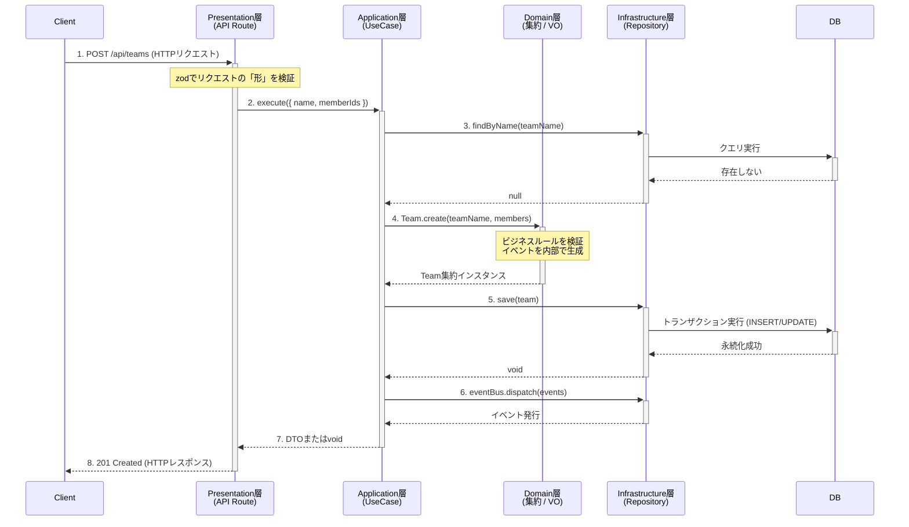
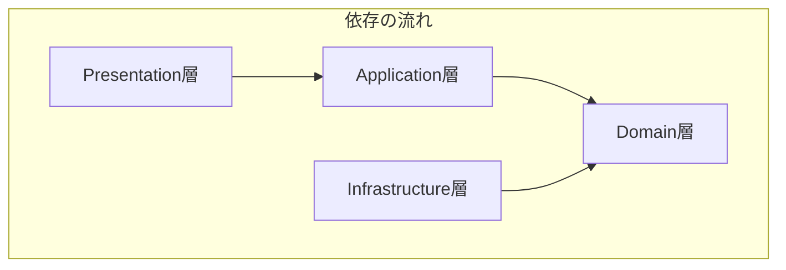

# DDD実装ルールブック

## 1. はじめに
このドキュメントは、本プロジェクトにおけるソフトウェアアーキテクチャの指針を定めるものです。すべてのコードは、ここに記述されたドメイン駆動設計（DDD）およびクリーンアーキテクチャの原則に従って実装される必要があります。
### 2-1. 設計思想：関心の分離と「豊かなドメインモデル」

本プロジェクトのアーキテクチャは、**関心の分離（Separation of Concerns）**を徹底し、**システムの核となるビジネスルール（ドメイン）を、技術的な詳細（UI、データベースなど）から完全に保護する**ことを目的としています。

これにより、以下のメリットを実現します。
* **保守性**: ビジネスルールを変更する際、UIやデータベースの実装を気にする必要がありません。
* **テスト容易性**: ドメインロジックを、UIやデータベースから独立した純粋なユニットテストで検証できます。
* **拡張性**: データベースをPostgreSQLから別のものに切り替えたり、APIをGraphQLに拡張したりする場合でも、ドメイン層への影響を最小限に抑えられます。

この目的を達成するため、本プロジェクトでは**オニオンアーキテクチャ**の考え方を採用し、ビジネスロジックを内包した**「豊かなドメインモデル」**の構築を目指します。

### 2-2. レイヤー構造とデータの流れ

アーキテクチャは以下の4層で構成され、データの流れは常に外側のレイヤーから内側へ向かいます。以下に、典型的なコマンド（例：チーム作成）処理の流れを示します。



## 2. アーキテクチャ概要
本プロジェクトでは、以下の4層からなるレイヤードアーキテクチャを採用します。

### 依存関係の原則
依存関係は、**常に外側のレイヤーから内側のレイヤーに向かいます。** 内側のレイヤーは、外側のレイヤーについて一切知りません。

※ただし、依存関係の注入(DI)によって、外側のレイヤーが内側のレイヤーのことを知っている（依存している）場合はあります。



* **Presentation層**: UIやAPIエンドポイント。`Application`層を利用する。
* **Application層**: ユースケース。`Domain`層を利用する。
* **Infrastructure層**: DBアクセスなど。`Domain`層で定義されたインターフェースを実装する。
* **Domain層**: ビジネスの核。どのレイヤーにも依存しない。

## 3. レイヤーごとの実装ルール

### 3-1. Domain層
**責務**: ビジネスルールの核心。このアプリケーションが「何であるか」を定義する。

**配置場所**: `src/domain/`

* **構成要素**:
    * **エンティティ**: 一意なIDで識別され、状態と振る舞いを持つオブジェクト (`User`, `Team`など)。
    * **値オブジェクト (VO)**: 値そのものが意味を持つ不変のオブジェクト (`Email`, `TeamName`など)。
    * **リポジトリのインターフェース**: データの永続化に関する「契約書」 (`IUserRepository`など)。

* **実装ルール**:
    1.  **依存の禁止**: 他のどのレイヤー（`application`, `presentation`, `infrastructure`）のファイルも`import`してはならない。
    2.  **外部ライブラリの禁止**: `Prisma`や`zod`、`Next.js`のAPIなど、フレームワークや外部ライブラリに依存するコードを記述してはならない。
    3.  **エンティティの生成**: `constructor`は`private`とし、必ず`create`（新規作成）や`rebuild`（再構築）といった静的ファクトリメソッド経由で生成する。
    4.  **不変条件の保護**: エンティティや値オブジェクトの不変条件（例: 名前の文字数制限）は、ファクトリメソッドやコンストラクタ内で検証し、違反する場合はドメイン固有のカスタムエラーをスローする。

---

### 3-2. Application層 (Use Case層)
**責務**: ユースケース（ユーザーがシステムで何を行いたいか）の実現。ドメイン層とインフラ層の協調。

**配置場所**: `src/application/`

* **構成要素**:
    * **ユースケースクラス**: １つのパブリックメソッド（`execute`）を持つクラス (`RegisterUserUseCase`など)。
    * **DTO (Data Transfer Object)**: Presentation層にデータを渡すための、メソッドを持たない純粋なデータの入れ物 (`UserDTO`など)。

* **実装ルール**:
    1.  **依存の方向**: `Domain`層にのみ依存する。`Presentation`層や`Infrastructure`層の具体的な実装を知ってはならない。
    2.  **入出力の定義**:
        * **入力**: `Presentation`層からプリミティブな値（`string`, `number`など）を受け取る。
        * **出力**: 成功した場合はDTOを返し、失敗した場合はビジネスルール違反を示すカスタムエラーをスローする。
    3.  **責務**: HTTPステータスコードやレスポンス形式など、プレゼンテーション層の関心事を知ってはならない。
    4.  **ロジック**: ドメインオブジェクトを生成・利用してビジネスフローを組み立て、結果をリポジトリ（のインターフェース）経由で永続化する。

---

### 3-3. Presentation層
**責務**: ユーザーとのインタラクション。HTTPリクエストの受付とレスポンスの返却。UIの描画。

**配置場所**: `src/app/`, `src/components/`

* **構成要素**:
    * Next.jsのAPI Routes (`/app/api/...`)
    * Reactコンポーネント

* **実装ルール**:
    1.  **UseCaseの利用**: DIコンテナ（後述）から完成品のUseCaseインスタンスを取得し、その`execute`メソッドを呼び出す。
    2.  **Infrastructure層への非依存**: `UserRepositoryPrisma`のような、Infrastructure層の具体的な実装クラスを`import`してはならない。
    3.  **レスポンスの責務**: UseCaseから返されたDTOやエラーを解釈し、適切なHTTPステータスコードとレスポンスボディ（JSON）を組み立てる。
    4.  **入力検証**: `zod`を使い、システムの入り口であるAPIエンドポイントで全てのリクエストを検証する。

---

### 3-4. Infrastructure層
**責務**: データベースアクセスや外部API連携など、技術的な詳細の実装。

**配置場所**: `src/infrastructure/`

* **構成要素**:
    * リポジトリの実装クラス (`UserRepositoryPrisma`)
    * PrismaClientのインスタンス

* **実装ルール**:
    1.  **インターフェースの実装**: `Domain`層で定義されたリポジトリのインターフェースを依存(`implements`)させる。
    2.  **依存の方向**: `Application`層や`Presentation`層に依存してはならない。
    3.  **データ変換**: ドメインオブジェクト（`User`エンティティなど）と、Prismaが扱うDBモデルの間のデータ変換を行う。

## 4. 依存関係の解決
オブジェクトの生成と依存関係の注入（DI）は、アプリケーション全体で一箇所に集約する。

* **場所**: `src/server/usecases.ts`
* **役割**: アプリケーション起動時に、`PrismaClient`、全てのリポジトリ、全てのUseCaseのインスタンスを生成する。
* **ルール**: `PrismaClient`はシングルトンとして扱う。各UseCaseのインスタンスは、このファイルから`export`され、`Presentation`層で`import`して利用する。

※ `src/server/usecases.ts`のような一元管理の場所がないと、Presentation層のAPI中で直接UseCaseやRepositoryを生成することになる（密結合）。
```ts
// Presentation層 (もしルールがなかった場合の悪い例)
// /src/app/api/users/route.ts

import { UserRepositoryPrisma } from "../../../infrastructure/repositories/UserRepositoryPrisma";
import { RegisterUserUseCase } from "../../../application/user/usecases/RegisterUserUseCase";
import { PrismaClient } from "@prisma/client";

export async function POST(req: Request) {
  // 1. 使う場所で、依存オブジェクトを自分で組み立てる
  const prisma = new PrismaClient(); // 非効率！
  const userRepository = new UserRepositoryPrisma(prisma);
  const registerUserUseCase = new RegisterUserUseCase(userRepository, /* eventBusは？ */);

  // 2. ユースケースを実行
  const user = await registerUserUseCase.execute(...);
  // ...
}
```
## 5. `zod`の利用ルール
`zod`は、信頼できない外部からのデータを検証する「門番」として利用する。

* **利用場所**:
    1.  **Presentation層 (API Route)**: **必須**。全てのAPIリクエストを検証する。
    2.  **フロントエンド (Reactコンポーネント)**: **推奨**。UX向上や意図しない値を画面に表示しないため、クライアントサイドでもバリデーションを行う。
* **スキーマの置き場所**: `src/lib/schemas/`に配置し、フロントエンドとバックエンドで共有する。
* **利用しない場所**: `Domain`層/`Infrastructure`層/`Application`層は、`zod`の存在を知ってはならない（ただし、`Infrastructure`層がサードパーティの外部APIと通信する場合は例外とする）。

## 6. ドメインイベント

### 6-1. 原則: 集約間の疎結合を実現する

ドメインイベントの主な目的は、**ある集約で発生した出来事が、別の集約に影響を与える際の直接的な依存関係をなくし、関心を分離すること**です。

これにより、各ドメインは適切に責務を分離でき、拡張性の高い設計になることが期待できます。

### 6-2. 導入の判断基準

#### ルール6-2-1: 集約の境界を越える副作用のために利用する

ドメインイベントは、**ある集約（例: `User`）の状態変更が、別の集約（例: `Team`, `Pair`）への後続処理（副作用）を必要とする場合**に導入します。

* **適切な例**: ユーザーが「退会」した時（`User`集約の変更）、そのユーザーを所属する全ての`Team`集約から脱退させる。この場合、`UserWithdrew`（ユーザーが退会した）イベントを発行します。

* **不適切な例**: チーム作成時に、名前が3文字以下であるか検証する。これは`Team`集約内で完結する単純な検証であり、イベントは不要です。

### 6-3. 実装ルール

#### ルール6-3-1: イベントは不変の「事実」として過去形で命名する

イベントは、過去に発生した変更不可能な「出来事」を表します。そのため、必ず**不変（Immutable）なオブジェクト**として設計し、**過去形の動詞**で命名します。

* 良い例: `UserRegistered`, `TeamCreated`, `TaskCompleted`
* 悪い例: `CreateUser`, `CompleteTask`

#### ルール6-3-2: イベントの発生は集約ルートの責務とする

ビジネス上、イベントを発生させるべき重要な出来事かどうかを判断するのは、**集約ルート（エンティティ）自身**の責務です。集約は、自身の状態が変更されるメソッド内でイベントを生成します。

```typescript
// src/domain/user/User.ts
import { AggregateRoot } from '../shared/AggregateRoot'; // ドメインイベントを管理する基底クラス
import { DomainError } from '../shared/DomainError';
import { UserStatus } from './UserStatus';
import { UserWithdrew } from '../events/UserWithdrew';

class User extends AggregateRoot {
  // ... constructor etc.

  public withdraw(): void {
    if (this.status === UserStatus.Withdrawn) {
      throw new DomainError('既に退会済みのユーザーです。');
    }
    this.status = UserStatus.Withdrawn;

    // 自身の状態変更に伴い、イベントを生成する
    this.addDomainEvent(new UserWithdrew(this.id));
  }
}
```

#### ルール6-3-3: イベントの発行はApplication層（UseCase）の責務とする
生成されたイベントを実際にイベントバスへ通知（発行・ディスパッチ）するのは、**Application層（UseCase）**の責務です。これにより、ドメイン層はイベントバスというインフラ層の仕組みに依存せずに済みます。

発行は、必ず集約の状態が正常に永続化された後に行います。

```ts
// src/application/user/usecases/WithdrawUserUseCase.ts
import { IUserRepository } from '../../../domain/user/IUserRepository';
import { IEventBus } from '../../../domain/shared/IEventBus';

export class WithdrawUserUseCase {
  constructor(
    private readonly userRepository: IUserRepository,
    private readonly eventBus: IEventBus
  ) {}

  async execute(userId: string): Promise<void> {
    // 1. 集約を取得
    const user = await this.userRepository.findById(userId);
    if (!user) {
      throw new Error('User not found');
    }

    // 2. ドメインロジックを実行（この中でイベントが生成される）
    user.withdraw();

    // 3. まず状態を永続化する
    await this.userRepository.save(user);

    // 4. 永続化が成功した後、イベントを発行する
    await this.eventBus.dispatch(user.getDomainEvents());
  }
}
```
#### ルール6-3-4: イベントハンドラーは独立したUseCaseとしてApplication層に配置する
イベントを購読して具体的な処理を行うイベントハンドラーは、特定のイベントに反応する小さなUseCaseと見なせます。そのため、Application層に配置し、必要に応じてリポジトリなどのインフラ層のインターフェースに依存します。

- `src/application/team/event-handlers/RemoveUserFromTeamsOnUserWithdrewHandler.ts`
- `src/application/pair/event-handlers/InvalidatePairsOnUserWithdrewHandler.ts`


## 7. ドメインサービスの利用方針

### 7-1. 原則: 現時点では導入しない

本プロジェクトでは、ドメイン層のロジックを極力エンティティおよび値オブジェクトに集約させる「豊かなドメインモデル」を目指します。

そのため、原則として**ドメインサービスは導入せず**、よりシンプルな責務分担による設計を維持します。

### 7-2. 理由: 関心の分離と責務の明確化

安易なドメインサービスの利用は、エンティティからロジックが失われ、単なるデータ置き場になってしまう「貧血なドメインモデル」を招くリスクがあります。

本プロジェクトのアーキテクチャでは、以下の責務分担を基本とします。

* **ドメイン層 (エンティティ / 値オブジェクト)**:
    * 自己完結したビジネスルールを担当する**「専門家」**。
    * 自身の状態と振る舞いに責任を持つ。

* **アプリケーション層 (UseCase)**:
    * 複数のドメインオブジェクトやリポジトリを調整し、業務フローを実現する**「指揮者（オーケストレーター）」**。
    * ドメイン知識そのものではなく、その「使い方」に責任を持つ。

### 7-3. 代替アプローチ: UseCaseによるオーケストレーション

複数の集約が関わるロジックは、ドメインサービスを新たに設けず、**Application層のUseCaseがその調整役を担います。**

```typescript
// 例: ユーザーをチームに追加するUseCase

export class AddUserToTeamUseCase {
  constructor(
    private readonly userRepository: IUserRepository,
    private readonly teamRepository: ITeamRepository
  ) {}

  async execute(userId: string, teamId: string): Promise<void> {
    // 1. 必要なエンティティを取得
    const user = await this.userRepository.findById(userId);
    const team = await this.teamRepository.findById(teamId);

    // 2. エンティティ自身のメソッドを呼び出し、ルールを検証
    //    (この調整がUseCaseの役割)
    if (!user.canJoinTeam()) {
      throw new UserCannotJoinTeamError(user.getName());
    }

    // 3. ドメインの振る舞いを実行
    team.addMember(user);

    // 4. 結果を永続化
    await this.teamRepository.save(team);
  }
}
```


### 7-4. 再検討のタイミング
以下のケースに該当し、UseCaseの責務がビジネスロジックで肥大化し始めた場合に、ドメインサービスの導入を例外的に検討します。

1. 複数のUseCaseで、ドメインに関する複雑なロジックが重複する場合。
2. それ自体が状態を持たない、重要なビジネス上の「プロセス」や「ポリシー」を表現する必要がある場合。（例: ユーザーのスコアリング計算、タスクの自動割り当てポリシーなど）

## 8. トランザクション管理
**責務**: データの整合性を保証する。

* **ルール**:
    1. トランザクションの境界は **集約単位** とする
    2. 1つのトランザクションで複数の集約を更新してはならない
    3. PrismaClientの提供する単一操作トランザクションを基本とする
    4. 複数の操作を1つのトランザクションで扱う必要がある場合のみ、明示的なトランザクション制御を行う

```typescript
// Infrastructure層での例（単一操作）
class UserRepositoryPrisma implements IUserRepository {
  async save(user: User): Promise<void> {
    // PrismaClientが自動的にトランザクションを管理
    await this.prisma.user.upsert({
      where: { id: user.getUserId() },
      create: { /* ... */ },
      update: { /* ... */ }
    });
  }
}

// 複数操作が必要な場合の例
class TeamRepositoryPrisma implements ITeamRepository {
  async saveTeamWithPairs(team: Team): Promise<void> {
    // 明示的なトランザクション制御
    await this.prisma.$transaction(async (tx) => {
      await tx.team.upsert({ /* ... */ });
      await tx.pair.createMany({ /* ... */ });
    });
  }
}
```

## 9. エラーハンドリング

### 9-1. 原則: エラーを「表現力のあるオブジェクト」として扱う

エラーは、単なる処理の失敗を示すものではなく、**「何が、なぜ、どのように失敗したのか」という具体的な情報を持つ、表現力のあるオブジェクト**として扱います。

これにより、呼び出し側のコードはエラーの型を元に具体的な分岐処理を行うことができ、堅牢でデバッグしやすいシステムを実現します。`new Error("some message")` のような汎用エラーの利用は、予期せぬ例外を除き、極力避けてください。

### 9-2. カスタムエラーを作成する判断基準

#### ルール9-2-1: 呼び出し側がエラーに応じた分岐処理を必要とする場合に作成する

カスタムエラーは、**そのエラーを受け取った呼び出し側のコード（例: Presentation層）が、エラーの種類に応じて具体的な処理（例: 特定のHTTPステータスコードの返却）を決定する必要がある場合**に作成します。

* **作成すべき例**:
    * `UserAlreadyExistsError`: `409 Conflict` を返すために、このエラー型を識別する必要がある。
    * `UserNotFoundError`: `404 Not Found` を返すために、このエラー型を識別する必要がある。
    * `InvalidParameterError`: `400 Bad Request` を返すために、このエラー型を識別する必要がある。

* **作成が不要な場合**:
    * 呼び出し側がエラーの種類を区別せず、一律で「予期せぬエラー」としてログ出力や500エラーの返却のみを行う場合。

### 9-3. 実装ルールと考慮事項

#### ルール9-3-1: エラーの責務をレイヤーごとに分離する

エラーもまた、他のオブジェクトと同様に所属するレイヤーの責務に従います。

* **DomainError (`src/domain/errors/`)**:
    * 純粋なビジネスルールの違反を表現します。
    * 例: `UserAlreadyExistsError`, `InvalidEmailFormatError`, `TeamMemberCountError`
    * HTTPステータスコードなど、技術的な詳細を知ってはなりません。

* **ApplicationError (`src/application/errors/`)**:
    * 特定のユースケースの失敗を表現します。
    * ドメインエラーをラップし、より具体的なユースケースの文脈を付け加える場合に利用します。（例: `UserRegistrationFailedError`）
    * 必須ではありません。多くの場合はドメインエラーをそのままスローすることで十分です。

#### ルール9-3-2: ビジネスルール違反を明確に表現する命名規則を用いる

エラークラスの名前は、**どのようなビジネスルールに違反したのかが一目でわかる**ように命名します。

* 良い例: `TeamNameTooLongError`, `PairMemberNotInSameTeamError`
* 悪い例: `Error1`, `TeamRuleError` (具体性に欠ける)

#### ルール9-3-3: ログやデバッグに有用なコンテキスト情報を含める

エラーオブジェクトには、エラーメッセージに加えて、**問題解決に役立つコンテキスト情報**を含めることを推奨します。

```typescript
export class UserAlreadyExistsError extends DomainError {
  constructor(readonly email: string) { // どのメールアドレスが重複したか
    super(`このメールアドレスは既に登録されています: ${email}`);
    this.name = 'UserAlreadyExistsError';
  }
}
```

#### ルール9-3-4: 共通の基底クラスを継承し、エラーの階層を設計する
DomainErrorやApplicationErrorのような抽象基底クラスを設けることで、エラーの大分類でのキャッチが可能になり、コードの可読性が向上します。

```ts
// Presentation層でのエラーハンドリング例
try {
  // ... UseCaseの実行
} catch (error) {
  if (error instanceof DomainError) { // ドメインルール違反全般
    // ... 400番台のエラーとして処理
  } else {
    // ... 予期せぬエラーとして500エラーで処理
  }
}
```

#### ルール9-3-5: Presentation層でエラーをHTTPステータスへマッピングする
エラーオブジェクトを具体的なHTTPステータスコードに変換するのは、Presentation層の唯一の責務です。これにより、ドメイン層とアプリケーション層はHTTPプロトコルから完全に独立した状態を保てます。

```ts
// src/app/api/users/route.ts のエラーハンドリング部分
} catch (error) {
  if (error instanceof UserAlreadyExistsError) {
    return NextResponse.json({ message: error.message, email: error.email }, { status: 409 });
  }
  if (error instanceof InvalidEmailFormatError) {
    return NextResponse.json({ message: error.message }, { status: 400 });
  }
  // ... 他のカスタムエラーに対するマッピング

  // 想定外のエラーは上位で処理（またはここで500を返す）
  throw error;
}
```

## 10. テスト戦略

### 10-1. 原則: テストピラミッドに基づき、各レイヤーの責務を保証する

本プロジェクトのテスト戦略は、**テストピラミッド**の考え方を基本とします。つまり、高速で安価なユニットテストを土台の大部分とし、低速で高コストなインテグレーションテストは少数に留めます。

テストの目的は、**各レイヤーが自身の責務を正しく果たしていることを保証すること**です。テストが失敗した際、問題がどのレイヤーにあるのかを即座に特定できる状態を目指します。

### 10-2. レイヤーごとのテスト戦略

#### 10-2-1. ドメイン層: ビジネスルールのユニットテスト

* **目的**: システムの核であるビジネスロジックが、外部の技術に一切依存せず、単体で正しく振る舞うことを保証します。
* **テスト対象**: エンティティ、値オブジェクト、集約

* **実装ルール**:
    1.  **モックは一切使用しない。**
        ドメイン層は自己完結しているため、依存対象がありません。テスト対象のロジックを直接検証します。
    2.  **不変条件と振る舞いを検証する。**
        * ファクトリメソッド（`create`）が、正常な値でインスタンスを正しく生成できること。
        * 不正な値を与えた場合に、期待したドメインエラーをスローすること。
        * エンティティのメソッドを呼び出した際に、状態が正しく変更されること。

#### 10-2-2. アプリケーション層: ユースケースのユニットテスト

* **目的**: ビジネスの業務フロー（ユースケース）が、ドメインとインフラを正しく協調させていることを保証します。
* **テスト対象**: ユースケースクラス (`...UseCase.ts`)

* **実装ルール**:
    1.  **リポジトリやイベントバス等、インフラ層への依存は全てモック化する。**
        これにより、テストはDBなどの外部要因から切り離され、高速かつ安定して実行できます。
    2.  **ビジネスフローの分岐と、依存先の呼び出しを検証する。**
        * リポジトリからの戻り値（オブジェクト、`null`など）に応じて、ロジックが正しく分岐すること。
        * 期待したドメインオブジェクトのメソッドが呼び出されること。
        * 期待したリポジトリのメソッド（`save`など）が、正しい引数で呼び出されること。
        * 期待したドメインイベントが発行されること。

#### 10-2-3. インフラストラクチャ層: 外部システムとのインテグレーションテスト

* **目的**: データベースなどの外部システムとの接続、およびデータのやり取りが正しく機能することを保証します。
* **テスト対象**: リポジトリの実装クラス (`...RepositoryPrisma.ts`)

* **実装ルール**:
    1.  **原則としてモックを使用せず、実際のDB（テスト用のDBコンテナなど）に接続する。**
        モックでは検証できない、SQLクエリの正当性やDBスキーマとの整合性を確認するためです。
    2.  **ドメインオブジェクトとDBレコード間のマッピングを検証する。**
        * `save`メソッドでドメインオブジェクトを渡した際、DBに期待通りのレコードが永続化されること。
        * DBから取得したレコードを、ドメインオブジェクトとして正しく再構築（`rebuild`）できること。
        * DBの制約（ユニーク制約など）が期待通りに機能すること。

### 10-3. テストの配置と命名

* **ルール10-3-1**: テストファイルは、テスト対象の実装ファイルと**同じディレクトリ**に、`{ファイル名}.test.ts` という命名で配置します。（`__tests__`フォルダには配置しない）

### 10-4. テスト範囲外とするもの

#### ルール10-4-1: E2E（End-to-End）テストは実施しない

本プロジェクトでは、ブラウザを自動化してユーザー操作をシミュレートするE2Eテストは、原則として実施しません。

* **理由**:
    本プロジェクトのアーキテクチャは、**フロントエンドにビジネスロジックを極力持たず**、UIの描画とユーザー操作の伝達に責務を限定する方針を採っています。
    システムの振る舞いを保証する核心的なビジネスロジックは、これまで定義したドメイン層、アプリケーション層、インフラストラクチャ層のテストで十分に網羅されています。
    そのため、実装とメンテナンスのコストが高いE2Eテストは、費用対効果が見合わないと判断します。