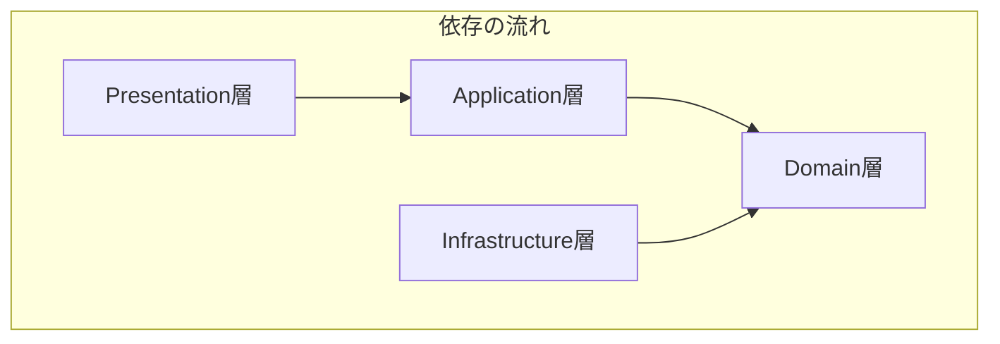

# DDD実装ルールブック

## 1. はじめに
このドキュメントは、本プロジェクトにおけるソフトウェアアーキテクチャの指針を定めるものです。すべてのコードは、ここに記述されたドメイン駆動設計（DDD）およびクリーンアーキテクチャの原則に従って実装される必要があります。

## 2. アーキテクチャ概要
本プロジェクトでは、以下の4層からなるレイヤードアーキテクチャを採用します。

### 依存関係の原則
依存関係は、**常に外側のレイヤーから内側のレイヤーに向かいます。** 内側のレイヤーは、外側のレイヤーについて一切知りません。

※ただし、依存関係の注入(DI)によって、外側のレイヤーが、内側のレイヤーのことを知っている（依存している）場合はあります。



* **Presentation層**: UIやAPIエンドポイント。`Application`層を利用する。
* **Application層**: ユースケース。`Domain`層を利用する。
* **Infrastructure層**: DBアクセスなど。`Domain`層で定義されたインターフェースを実装する。
* **Domain層**: ビジネスの核。どのレイヤーにも依存しない。

## 3. レイヤーごとの実装ルール

### 3-1. Domain層
**責務**: ビジネスルールの核心。このアプリケーションが「何であるか」を定義する。
**配置場所**: `src/domain/`

* **構成要素**:
    * **エンティティ**: 一意なIDで識別され、状態と振る舞いを持つオブジェクト (`User`, `Team`など)。
    * **値オブジェクト (VO)**: 値そのものが意味を持つ不変のオブジェクト (`Email`, `TeamName`など)。
    * **ドメインサービス**: 特定のエンティティに属さない、ドメインに関する操作。
    * **リポジトリのインターフェース**: データの永続化に関する「契約書」 (`IUserRepository`など)。

* **実装ルール**:
    1.  **依存の禁止**: 他のどのレイヤー（`application`, `presentation`, `infrastructure`）のファイルも`import`してはならない。
    2.  **外部ライブラリの禁止**: `Prisma`や`zod`、`Next.js`のAPIなど、フレームワークや外部ライブラリに依存するコードを記述してはならない。
    3.  **エンティティの生成**: `constructor`は`private`とし、必ず`create`（新規作成）や`rebuild`（再構築）といった静的ファクトリメソッド経由で生成する。
    4.  **不変条件の保護**: エンティティや値オブジェクトの不変条件（例: 名前の文字数制限）は、ファクトリメソッドやコンストラクタ内で検証し、違反する場合はドメイン固有のカスタムエラーをスローする。
    5.  **リポジトリの利用**: ドメインサービスがリポジトリに依存する場合は、具体的な実装クラスではなく、Domain層で定義されたインターフェース（`IUserRepository`など）にのみ依存する。

---

### 3-2. Application層 (Use Case層)
**責務**: ユースケース（ユーザーがシステムで何を行いたいか）の実現。ドメイン層とインフラ層の協調。
**配置場所**: `src/application/`

* **構成要素**:
    * **ユースケースクラス**: １つのパブリックメソッド（`execute`）を持つクラス (`RegisterUserUseCase`など)。
    * **DTO (Data Transfer Object)**: Presentation層にデータを渡すための、メソッドを持たない純粋なデータの入れ物 (`UserDTO`など)。

* **実装ルール**:
    1.  **依存の方向**: `Domain`層にのみ依存する。`Presentation`層や`Infrastructure`層の具体的な実装を知ってはならない。
    2.  **入出力の定義**:
        * **入力**: `Presentation`層からプリミティブな値（`string`, `number`など）を受け取る。
        * **出力**: 成功した場合はDTOを返し、失敗した場合はビジネスルール違反を示すカスタムエラーをスローする。
    3.  **責務**: HTTPステータスコードやレスポンス形式など、プレゼンテーション層の関心事を知ってはならない。
    4.  **ロジック**: ドメインオブジェクトを生成・利用してビジネスフローを組み立て、結果をリポジトリ（のインターフェース）経由で永続化する。

---

### 3-3. Presentation層
**責務**: ユーザーとのインタラクション。HTTPリクエストの受付とレスポンスの返却。UIの描画。
**配置場所**: `src/app/`, `src/components/`

* **構成要素**:
    * Next.jsのAPI Routes (`/app/api/...`)
    * Reactコンポーネント

* **実装ルール**:
    1.  **UseCaseの利用**: DIコンテナ（後述）から完成品のUseCaseインスタンスを取得し、その`execute`メソッドを呼び出す。
    2.  **Infrastructure層への非依存**: `UserRepositoryPrisma`のような、Infrastructure層の具体的な実装クラスを`import`してはならない。
    3.  **レスポンスの責務**: UseCaseから返されたDTOやエラーを解釈し、適切なHTTPステータスコードとレスポンスボディ（JSON）を組み立てる。
    4.  **入力検証**: `zod`を使い、システムの入り口であるAPIエンドポイントで全てのリクエストを検証する。

---

### 3-4. Infrastructure層
**責務**: データベースアクセスや外部API連携など、技術的な詳細の実装。
**配置場所**: `src/infrastructure/`

* **構成要素**:
    * リポジトリの実装クラス (`UserRepositoryPrisma`)
    * PrismaClientのインスタンス

* **実装ルール**:
    1.  **インターフェースの実装**: `Domain`層で定義されたリポジトリのインターフェースを依存(`implements`)させる。
    2.  **依存の方向**: `Application`層や`Presentation`層に依存してはならない。
    3.  **データ変換**: ドメインオブジェクト（`User`エンティティなど）と、Prismaが扱うDBモデルの間のデータ変換を行う。

## 4. 依存関係の解決
オブジェクトの生成と依存関係の注入（DI）は、アプリケーション全体で一箇所に集約する。

* **場所**: `src/server/usecases.ts`
* **役割**: アプリケーション起動時に、`PrismaClient`、全てのリポジトリ、全てのUseCaseのインスタンスを生成する。
* **ルール**: `PrismaClient`はシングルトンとして扱う。各UseCaseのインスタンスは、このファイルから`export`され、`Presentation`層で`import`して利用する。

## 5. `zod`の利用ルール
`zod`は、信頼できない外部からのデータを検証する「門番」として利用する。

* **利用場所**:
    1.  **Presentation層 (API Route)**: **必須**。全てのAPIリクエストを検証する。
    2.  **フロントエンド (Reactコンポーネント)**: **推奨**。UX向上や意図しない値を画面に表示しないため、クライアントサイドでもバリデーションを行う。
* **スキーマの置き場所**: `src/lib/schemas/`に配置し、フロントエンドとバックエンドで共有する。
* **利用しない場所**: `Domain`層および`Application`層は、`zod`の存在を知ってはならない。

## 6. ドメインイベント
**責務**: ドメイン内で発生した重要な出来事を表現し、後続の処理をトリガーする。
**配置場所**: `src/domain/events/`

* **構成要素**:
    * **イベントクラス**: 発生した出来事を表現するデータ構造 (`UserRegisteredEvent`など)
    * **イベントハンドラー**: イベントに対する処理を実装 (`WelcomeEmailHandler`など)
    * **イベントバス**: イベントの発行と購読を仲介するインフラストラクチャ

* **実装ルール**:
    1. イベントは不変（Immutable）であり、過去形で命名する（例：`UserRegistered`, `TeamCreated`）
    2. イベントハンドラーは `Application` 層に配置し、ドメインサービスやユースケースから利用する
    3. 集約ルートがイベントを発行する場合は、`DomainEvents.raise(new UserRegisteredEvent(...))`のように明示的に行う

## 7. トランザクション管理
**責務**: データの整合性を保証する。

* **ルール**:
    1. トランザクションの境界は **集約単位** とする
    2. 1つのトランザクションで複数の集約を更新してはならない
    3. PrismaClientの提供する単一操作トランザクションを基本とする
    4. 複数の操作を1つのトランザクションで扱う必要がある場合のみ、明示的なトランザクション制御を行う

```typescript
// Infrastructure層での例（単一操作）
class UserRepositoryPrisma implements IUserRepository {
  async save(user: User): Promise<void> {
    // PrismaClientが自動的にトランザクションを管理
    await this.prisma.user.upsert({
      where: { id: user.getUserId() },
      create: { /* ... */ },
      update: { /* ... */ }
    });
  }
}

// 複数操作が必要な場合の例
class TeamRepositoryPrisma implements ITeamRepository {
  async saveTeamWithPairs(team: Team): Promise<void> {
    // 明示的なトランザクション制御
    await this.prisma.$transaction(async (tx) => {
      await tx.team.upsert({ /* ... */ });
      await tx.pair.createMany({ /* ... */ });
    });
  }
}
```

## 8. エラーハンドリング
**責務**: ドメインルール違反や技術的エラーを適切に表現し、処理する。
**配置場所**: `src/domain/errors/`, `src/application/errors/`

* **エラーの階層**:
    ```typescript
    // ドメインエラー（Domain層）
    abstract class DomainError extends Error {}
    class UserAlreadyExistsError extends DomainError {}
    class InvalidEmailError extends DomainError {}

    // アプリケーションエラー（Application層）
    abstract class ApplicationError extends Error {}
    class UserRegistrationError extends ApplicationError {}
    ```

* **実装ルール**:
    1. ドメイン層では具体的なビジネスルール違反を表現するエラーをスローする
    2. Application層では、必要に応じてドメインエラーをアプリケーションエラーに変換する
    3. Presentation層では、エラーを適切なHTTPステータスコードにマッピングする

## 9. テスト戦略
**配置場所**: 各実装ファイルと同じディレクトリに `.test.ts` ファイルとして配置

* **テストの種類と範囲**:
    1. **ドメインテスト**: 値オブジェクト、エンティティ、集約の不変条件をテスト
       - 例: `src/domain/user/User.test.ts`
       - 例: `src/domain/shared/Email.test.ts`
    2. **ユースケーステスト**: アプリケーション層のビジネスフローをテスト
       - 例: `src/application/user/usecases/RegisterUserUseCase.test.ts`
    3. **インテグレーションテスト**: リポジトリの実装をテスト
       - 例: `src/infrastructure/repositories/UserRepository.test.ts`

* **モック化のルール**:
    1. ドメイン層のテストではモックを使用しない
    2. アプリケーション層のテストでは、リポジトリをモック化する
    3. インフラストラクチャ層のテストでは、実際のDBを使用する

```typescript
// ドメインテストの例
describe('User', () => {
  it('should create a valid user', () => {
    const user = User.create({
      email: new Email('test@example.com'),
      name: new UserName('Test User')
    });
    expect(user).toBeDefined();
  });

  it('should throw error when email is invalid', () => {
    expect(() => {
      User.create({
        email: new Email('invalid-email'),
        name: new UserName('Test User')
      });
    }).toThrow(InvalidEmailError);
  });
});
```

## 10. 実装例：ユーザー登録フロー

以下は、DDDの原則に従ったユーザー登録機能の実装例です。各レイヤーの責務と協調の仕方を示しています。

### Domain層
```typescript
// 値オブジェクト（src/domain/shared/Email.ts）
export class Email {
  private constructor(private readonly value: string) {}

  static create(value: string): Email {
    // ドメインの制約を検証
    if (!this.isValidEmailFormat(value)) {
      throw new InvalidEmailFormatError(value);
    }
    return new Email(value);
  }

  getValue(): string {
    return this.value;
  }
}

// エンティティ（src/domain/user/User.ts）
export class User {
  private constructor(
    private readonly id: string,
    private readonly email: Email,
    private readonly name: string,
    private status: UserStatus
  ) {}

  // ファクトリメソッド - 新規作成用
  static create(name: string, emailStr: string): User {
    return new User(
      crypto.randomUUID(),  // IDの生成
      Email.create(emailStr),  // 値オブジェクトの生成
      name,
      UserStatus.Enrolled
    );
  }

  // ファクトリメソッド - 再構築用
  static rebuild(id: string, name: string, emailStr: string, status: UserStatus): User {
    return new User(
      id,
      Email.create(emailStr),
      name,
      status
    );
  }

  // 不変条件を保護するメソッド
  changeName(newName: string): void {
    if (newName.length < 1) {
      throw new InvalidUserNameError('名前は1文字以上である必要があります');
    }
    this.name = newName;
  }
}

// リポジトリインターフェース（src/domain/user/IUserRepository.ts）
export interface IUserRepository {
  save(user: User): Promise<void>;
  findByEmail(email: Email): Promise<User | null>;
}

// ドメインエラー（src/domain/user/errors/UserValidationError.ts）
export class UserAlreadyExistsError extends Error {
  constructor(email: string) {
    super(`このメールアドレスは既に登録されています: ${email}`);
    this.name = 'UserAlreadyExistsError';
  }
}
```

### Application層
```typescript
// DTOの定義（src/application/user/dto/UserDTO.ts）
export class UserDTO {
  constructor(
    public readonly name: string,
    public readonly email: string
  ) {}

  static fromDomain(user: User): UserDTO {
    return new UserDTO(
      user.getName(),
      user.getEmail()
    );
  }
}

// ユースケース（src/application/user/usecases/RegisterUserUseCase.ts）
export class RegisterUserUseCase {
  constructor(
    private readonly userRepository: IUserRepository,
    private readonly eventBus: EventBus
  ) {}

  async execute(name: string, email: string): Promise<UserDTO> {
    // 1. 入力値からドメインの値オブジェクトを生成
    const emailVO = Email.create(email);

    // 2. ドメインのビジネスルールを検証
    const existingUser = await this.userRepository.findByEmail(emailVO);
    if (existingUser) {
      throw new UserAlreadyExistsError(email);
    }

    // 3. ドメインオブジェクトを生成
    const user = User.create(name, email);

    // 4. 永続化
    await this.userRepository.save(user);

    // 5. ドメインイベントの発行
    await this.eventBus.publish(new UserRegisteredEvent(user.getId()));

    // 6. DTOに変換して返却
    return UserDTO.fromDomain(user);
  }
}
```

### Infrastructure層
```typescript
// リポジトリの実装（src/infrastructure/repositories/UserRepositoryPrisma.ts）
export class UserRepositoryPrisma implements IUserRepository {
  constructor(private readonly prisma: PrismaClient) {}

  async save(user: User): Promise<void> {
    // ドメインオブジェクト → DBモデルの変換
    await this.prisma.user.upsert({
      where: { id: user.getId() },
      create: {
        id: user.getId(),
        email: user.getEmail(),
        name: user.getName(),
        status: user.getStatus(),
        createdAt: new Date(),
        updatedAt: new Date(),
      },
      update: {
        email: user.getEmail(),
        name: user.getName(),
        status: user.getStatus(),
        updatedAt: new Date(),
      },
    });
  }

  async findByEmail(email: Email): Promise<User | null> {
    const user = await this.prisma.user.findUnique({
      where: { email: email.getValue() },
    });

    // DBモデル → ドメインオブジェクトの変換
    return user
      ? User.rebuild(
          user.id,
          user.name,
          user.email,
          user.status as UserStatus
        )
      : null;
  }
}
```

### Presentation層
```typescript
// API Route（src/app/api/users/route.ts）
export async function POST(req: Request) {
  try {
    // 1. リクエストの検証
    const body = await req.json();
    const validatedData = registerUserSchema.parse(body);
    // 2. ユースケースの実行
    const user = await registerUserUseCase.execute(
      validatedData.name,
      validatedData.email
    );

    // 3. レスポンスの返却
    return NextResponse.json(user, { status: 201 });
  } catch (error) {
    // 4. エラーハンドリング
    if (error instanceof UserAlreadyExistsError) {
      return NextResponse.json(
        { message: error.message },
        { status: 409 }
      );
    }
    if (error instanceof InvalidEmailFormatError) {
      return NextResponse.json(
        { message: error.message },
        { status: 400 }
      );
    }
    throw error;  // 想定外のエラーは上位で処理
  }
}
```

このように実装することで、以下のDDDの原則が守られています：

1. **ドメイン層の独立性**
   - 値オブジェクトとエンティティが不変条件を保証
   - ドメインロジックがドメイン層に閉じ込められている
   - 外部への依存がインターフェースのみ

2. **ユビキタス言語の使用**
   - クラス名やメソッド名がドメインの用語を反映
   - エラーメッセージがビジネス的な意味を持つ

3. **レイヤー間の明確な境界**
   - 各レイヤーが明確な責務を持つ
   - 依存関係が内側に向かっている
   - DTOによるレイヤー間のデータ変換

4. **集約の整合性**
   - Userエンティティが自身の不変条件を保証
   - リポジトリが集約単位でデータを永続化

5. **ドメインイベント**
   - ビジネス的に重要な出来事をイベントとして表現
   - イベントバスによる疎結合な通知
