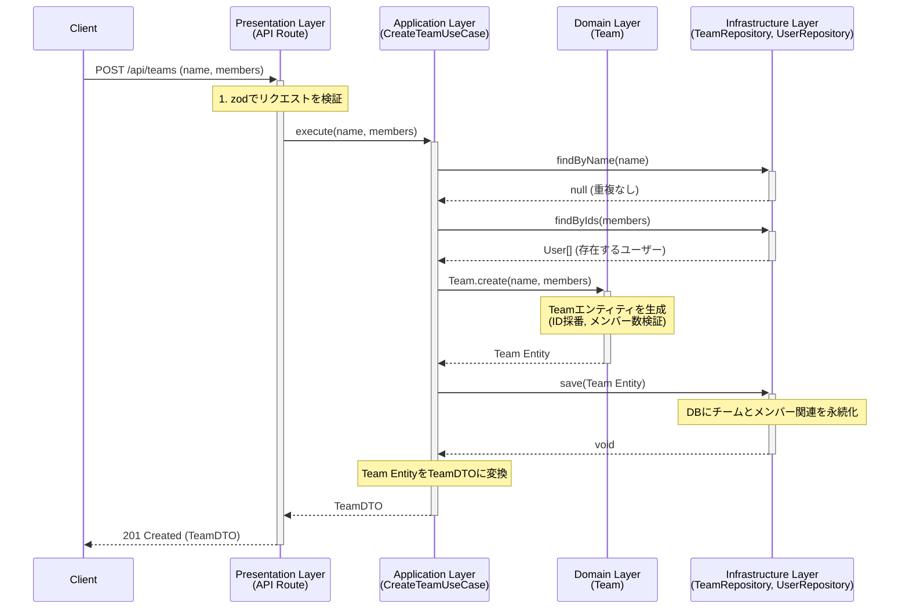
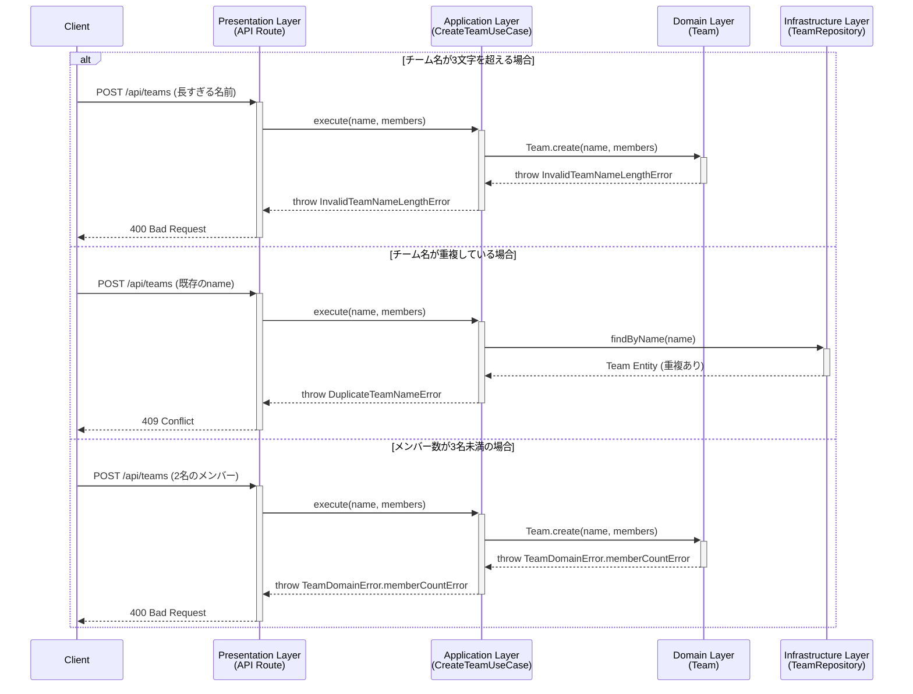

# ストーリー：新規チームを作成できる

## サマリー

このドキュメントは、システムに新しいチームを登録する際の仕様とプロセスを定義します。
ドメイン駆動設計の各レイヤーがどのように連携し、ビジネスルールを保証するかを示します。

## ビジネスルールと技術的制約

### 1. チーム情報

-   **入力項目:**
    -   チーム名: `name` (文字列)
    -   メンバー: `members` (ユーザーIDの配列)
-   **システム生成項目:**
    -   ID: `id` (一意な識別子, UUID)

### 2. バリデーションルール

-   **チーム名の命名規則:**
    -   **ルール:** チーム名は文字列でなければならない。
    -   **責務:** `Presentation`層 / `createTeamSchema`
    -   **違反時の挙動:** `400 Bad Request`を返し、登録処理を中断する。

-   **チーム名の文字数制限:**
    -   **ルール:** チーム名は3文字以下でなければならない。
    -   **責務:** `Domain`層 / `Team`エンティティ
    -   **違反時の挙動:** `InvalidTeamNameLengthError`をスローし、登録処理を中断する。

-   **チーム名の一意性:**
    -   **ルール:** 同一のチーム名は複数登録できない。
    -   **責務:** `Application`層 / `CreateTeamUseCase`
    -   **違反時の挙動:** `DuplicateTeamNameError`をスローし、登録処理を中断する。

-   **メンバー数の制限:**
    -   **ルール:** 各チームには最低3名のユーザーが所属していなければならない。
    -   **責務:** `Domain`層 / `Team`エンティティ
    -   **違反時の挙動:** `TeamDomainError.memberCountError`をスローし、登録処理を中断する。

## 正常系フロー

チーム作成が成功するまでの一連のステップです。

1.  **リクエスト受信 (`Presentation`層)**
    -   クライアントから `POST /api/teams` へチーム名とメンバーIDの配列を含んだリクエストが送信される。
    -   `zod`スキーマ (`createTeamSchema`) を用いて、リクエストボディの型とnameとmembersに関する制約（必須項目など）を検証する。

2.  **ユースケース実行 (`Application`層)**
    -   `CreateTeamUseCase`の`execute`メソッドが呼び出される。
    -   `ITeamRepository`の`findByName`を呼び出し、チーム名の重複を確認する。重複がある場合はエラーが発生する。
    -   `IUserRepository`の`findByIds`を呼び出し、指定されたメンバーが全て存在することを確認する。

3.  **ドメインオブジェクト生成 (`Domain`層)**
    -   `Team.create`ファクトリメソッドを呼び出し、新しい`Team`エンティティを生成する。
    -   IDが自動採番される。
    -   メンバー数が3名以上であることを検証する。

4.  **永続化 (`Infrastructure`層)**
    -   `ITeamRepository`の`save`メソッドを介して、`TeamRepositoryPrisma`が`Team`エンティティをデータベースに保存する。
    -   チームメンバーの関連テーブルにも保存される。

5.  **レスポンス返却 (`Presentation`層)**
    -   `Team`エンティティを`TeamDTO`に変換する。
    -   ステータスコード`201 Created`と共に、`TeamDTO`をJSON形式でクライアントに返す。

## 異常系・代替フロー

| エラーケース | 発生レイヤー | エラー型 | `Presentation`層の挙動 |
| :--- | :--- | :--- | :--- |
| チーム名が文字列でない | `Presentation` | `ZodError` | `400 Bad Request` とバリデーションエラーの詳細を返す。 |
| チーム名が3文字を超える | `Domain` | `TeamValidationError.teamNameTooLong` | `400 Bad Request` とエラーメッセージを返す。 |
| チーム名が既に登録済み | `Application` | `DuplicateTeamNameError` | `409 Conflict` とエラーメッセージを返す。 |
| メンバー数が3名未満 | `Domain` | `TeamDomainError.memberCountError` | `400 Bad Request` とエラーメッセージを返す。 |
| 指定されたメンバーが存在しない | `Application` | `UserNotFoundError` | `404 Not Found` とエラーメッセージを返す。 |
| リクエストの形式が不正 | `Presentation` | `ZodError` | `400 Bad Request` とバリデーションエラーの詳細を返す。 |
| その他の予期せぬエラー | - | `Error` | `500 Internal Server Error` として処理される。 |

