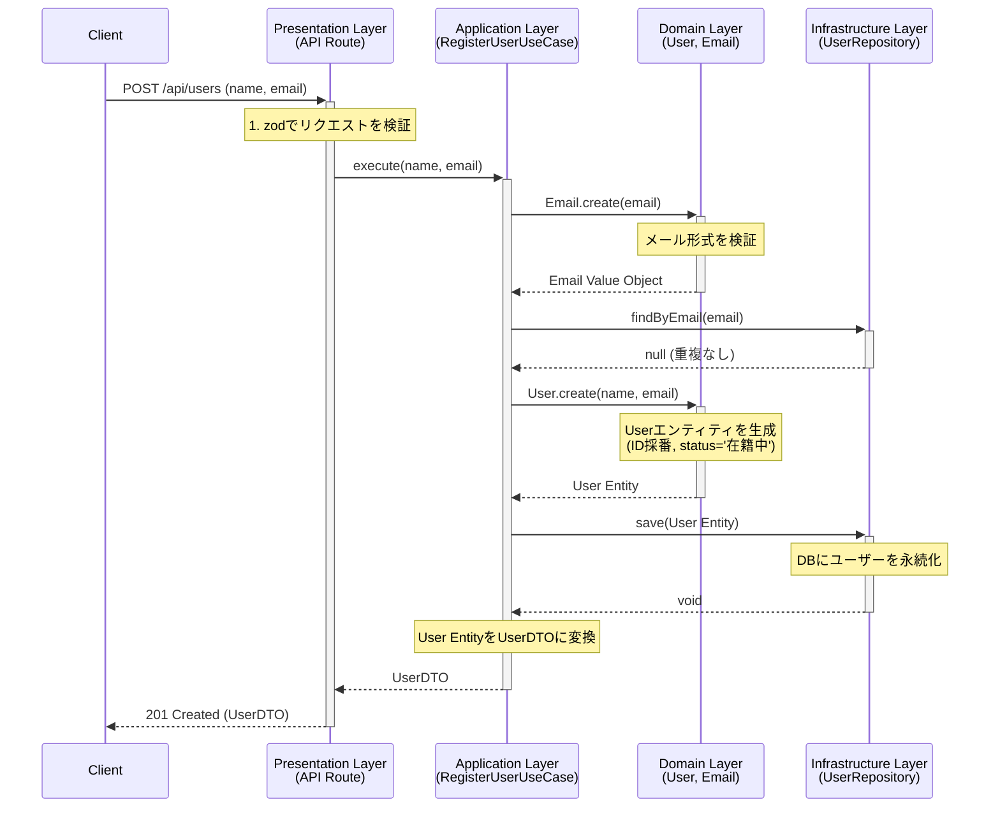
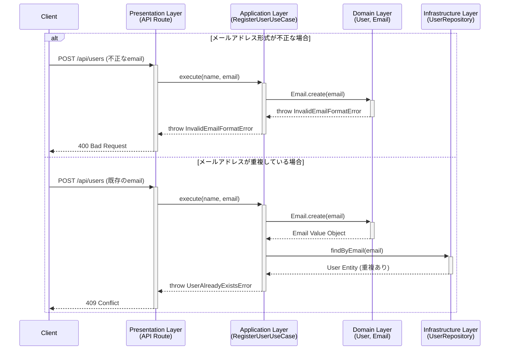

# ストーリー：ユーザー新規登録

## サマリー

このドキュメントは、システムに新しいユーザーを登録する際の仕様とプロセスを定義します。
ドメイン駆動設計の各レイヤーがどのように連携し、ビジネスルールを保証するかを示します。

## ビジネスルールと技術的制約

### 1. ユーザー情報

-   **入力項目:**
    -   名前: `name` (文字列)
    -   メールアドレス: `email` (文字列)
-   **システム生成項目:**
    -   ID: `id` (一意な識別子, UUID)
    -   ステータス: `status` (初期値は「在籍中」)

### 2. バリデーションルール

-   **メールアドレスの形式:**
    -   **ルール:** RFCに準拠するような一般的なメールアドレスの形式でなければならない。
    -   **責務:** `Domain`層 / `Email`値オブジェクト
    -   **違反時の挙動:** `InvalidEmailFormatError`をスローし、登録処理を中断する。

-   **メールアドレスの一意性:**
    -   **ルール:** 同一のメールアドレスは複数登録できない。
    -   **責務:** `Application`層 / `RegisterUserUseCase`
    -   **違反時の挙動:** `UserAlreadyExistsError`をスローし、登録処理を中断する。

-   **名前の文字数:**
    -   **ルール:** 1文字以上でなければならない。
    -   **責務:** `Presentation`層 (APIリクエストの検証) / `Domain`層 (`User.changeName`メソッド)
    -   **違反時の挙動:** `Presentation`層で`400 Bad Request`を返すか、`Domain`層で`InvalidUserNameError`をスローする。

## 正常系フロー

ユーザー登録が成功するまでの一連のステップです。

1.  **リクエスト受信 (`Presentation`層)**
    -   クライアントから `POST /api/users` へ名前とメールアドレスを含んだリクエストが送信される。
    -   `zod`スキーマ (`registerUserSchema`) を用いて、リクエストボディの型と基本的な制約（必須項目など）を検証する。

2.  **ユースケース実行 (`Application`層)**
    -   `RegisterUserUseCase`の`execute`メソッドが呼び出される。
    -   入力されたメールアドレス文字列から`Email`値オブジェクトを生成する。この時点で形式が不正な場合はエラーが発生する。
    -   `IUserRepository`の`findByEmail`を呼び出し、メールアドレスの重複を確認する。重複がある場合はエラーが発生する。

3.  **ドメインオブジェクト生成 (`Domain`層)**
    -   `User.create`ファクトリメソッドを呼び出し、新しい`User`エンティティを生成する。
    -   IDが自動採番され、ステータスは`UserStatus.Enrolled`（在籍中）に設定される。

4.  **永続化 (`Infrastructure`層)**
    -   `IUserRepository`の`save`メソッドを介して、`UserRepositoryPrisma`が`User`エンティティをデータベースに保存する。

5.  **レスポンス返却 (`Presentation`層)**
    -   `User`エンティティを`UserDTO`に変換する。
    -   ステータスコード`201 Created`と共に、`UserDTO`をJSON形式でクライアントに返す。

## 異常系・代替フロー

| エラーケース | 発生レイヤー | エラー型 | `Presentation`層の挙動 |
| :--- | :--- | :--- | :--- |
| メールアドレスの形式が不正 | `Domain` | `InvalidEmailFormatError` | `400 Bad Request` とエラーメッセージを返す。 |
| メールアドレスが既に登録済み | `Application` | `UserAlreadyExistsError` | `409 Conflict` とエラーメッセージを返す。 |
| リクエストの形式が不正 | `Presentation` | `ZodError` | `400 Bad Request` とバリデーションエラーの詳細を返す。 |
| その他の予期せぬエラー | - | `Error` | `500 Internal Server Error` として処理される。 |

